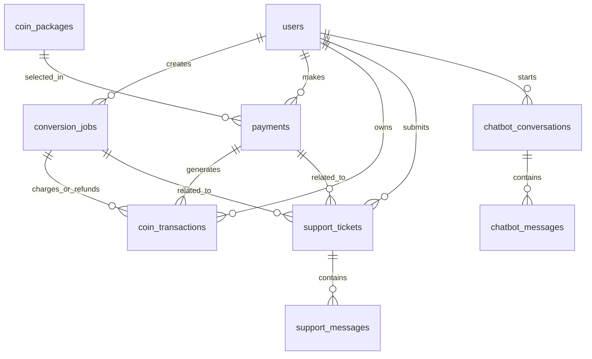

# Phân tích hệ thống website Convert PDF to Word

System Analysis & Workflows

## 1. Mục đích của phần phân tích hệ thống

Sau khi đã xác định yêu cầu cho website Convert PDF to Word, giai đoạn phân tích hệ thống giúp làm rõ hệ thống sẽ hoạt động như thế nào, gồm những thành phần nào, người dùng tương tác ra sao và dữ liệu được lưu trữ như thế nào.

Mục tiêu của phần này là:

- Xác định các vai trò tham gia vào hệ thống.
- Xác định các chức năng chính và chức năng phụ.
- Xác định dữ liệu cần lưu trữ.
- Mô tả luồng hoạt động chính của người dùng.
- Xác định các thực thể dữ liệu và mối quan hệ giữa chúng.
- Làm cơ sở cho bước thiết kế cơ sở dữ liệu, thiết kế giao diện và lập trình hệ thống.

---

## 2. Tổng quan hệ thống

Website Convert PDF to Word là hệ thống cho phép người dùng tải lên file PDF và chuyển đổi sang file Word định dạng `.docx`.

Hệ thống hỗ trợ hai chế độ chuyển đổi:

- **Chế độ miễn phí**: không tốn coin, nhưng bị giới hạn dung lượng file, số trang và số lần sử dụng mỗi ngày.
- **Chế độ nâng cao**: tốn coin, hỗ trợ xử lý tốt hơn, có thể hỗ trợ OCR, file lớn hơn và được ưu tiên xử lý.

Ngoài chức năng chuyển đổi file, hệ thống còn có các chức năng liên quan như:

- Đăng ký, đăng nhập.
- Quản lý tài khoản người dùng.
- Quản lý số dư coin.
- Nạp tiền mua coin.
- Lưu lịch sử chuyển đổi.
- Lưu lịch sử giao dịch coin.
- Quản trị người dùng, gói coin, giao dịch và lịch sử convert.
- Hỗ trợ người dùng qua chatbot AI hoặc hỗ trợ viên.
- Tiếp nhận và xử lý khiếu nại.

---

## 3. Các vai trò trong hệ thống

## 3.1. Khách chưa đăng nhập

Khách chưa đăng nhập là người dùng truy cập website nhưng chưa có tài khoản hoặc chưa đăng nhập.

Khách có thể:

- Xem trang chủ.
- Xem thông tin giới thiệu dịch vụ.
- Upload file PDF để dùng thử chế độ convert miễn phí nếu hệ thống cho phép.
- Sử dụng chatbot AI để hỏi các thông tin cơ bản.
- Đăng ký tài khoản.
- Đăng nhập vào hệ thống.

Giới hạn của khách:

- Không dùng được chế độ convert nâng cao bằng coin.
- Không có ví coin.
- Không nạp tiền mua coin.
- Không xem được lịch sử chuyển đổi cá nhân.
- Có thể bị giới hạn số lần convert miễn phí theo ngày, theo IP hoặc theo guest token.
- File convert miễn phí chỉ được lưu trong thời gian ngắn.

---

## 3.2. Người dùng đã đăng ký

Người dùng đã đăng ký là người có tài khoản trong hệ thống.

Người dùng có thể:

- Đăng nhập, đăng xuất.
- Cập nhật thông tin cá nhân.
- Upload file PDF.
- Chọn chế độ convert miễn phí hoặc nâng cao.
- Xem số coin cần dùng trước khi convert nâng cao.
- Sử dụng coin để convert nâng cao.
- Xem số dư coin.
- Nạp tiền mua coin.
- Xem lịch sử giao dịch coin.
- Xem lịch sử chuyển đổi file.
- Tải lại file DOCX nếu file chưa hết hạn.
- Gửi khiếu nại hoặc yêu cầu hỗ trợ.
- Nhắn tin với hỗ trợ viên.
- Sử dụng chatbot AI để hỏi thông tin về website.

---

## 3.3. Hỗ trợ viên

Hỗ trợ viên là người phụ trách tiếp nhận, phản hồi và xử lý các vấn đề của người dùng.

Hỗ trợ viên có thể:

- Xem danh sách khiếu nại hoặc yêu cầu hỗ trợ.
- Xem nội dung cuộc trò chuyện với người dùng.
- Phản hồi tin nhắn hỗ trợ.
- Cập nhật trạng thái ticket hỗ trợ.
- Xem một số thông tin liên quan đến lỗi convert, thanh toán hoặc coin để hỗ trợ người dùng.
- Chuyển vấn đề nghiêm trọng cho admin nếu cần.

Giới hạn của hỗ trợ viên:

- Không được tự ý thay đổi cấu hình hệ thống.
- Không được quản lý toàn bộ tài khoản người dùng như admin.
- Không được thay đổi gói coin nếu không có quyền.
- Không nên có quyền can thiệp trực tiếp vào dữ liệu thanh toán hoặc số dư coin, trừ khi được phân quyền rõ ràng.

---

## 3.4. Quản trị viên

Quản trị viên là người có quyền quản lý toàn bộ hệ thống.

Admin có thể:

- Quản lý tài khoản người dùng.
- Khóa hoặc mở khóa tài khoản.
- Xem số dư coin của người dùng.
- Cộng hoặc trừ coin thủ công khi cần.
- Quản lý gói nạp coin.
- Quản lý giao dịch nạp tiền.
- Xem lịch sử convert.
- Xem lịch sử giao dịch coin.
- Cấu hình giới hạn convert miễn phí.
- Cấu hình chi phí coin cho từng loại convert.
- Theo dõi lỗi convert.
- Theo dõi tài nguyên hệ thống.
- Xem thống kê lượng nạp coin.
- Xem thống kê doanh thu.
- Quản lý hỗ trợ viên.
- Theo dõi và xử lý khiếu nại.

---

## 4. Dữ liệu cần lưu trữ

Dựa trên yêu cầu hệ thống, website cần lưu trữ các nhóm dữ liệu sau:

## 4.1. Dữ liệu người dùng

Dữ liệu người dùng dùng để quản lý tài khoản, đăng nhập, phân quyền và số dư coin.

Thông tin cần lưu:

- ID người dùng.
- Họ tên.
- Email.
- Mật khẩu đã mã hóa.
- Vai trò: user, admin, support.
- Số dư coin.
- Trạng thái tài khoản.
- Lần đăng nhập gần nhất.
- Ngày tạo tài khoản.
- Ngày cập nhật tài khoản.

---

## 4.2. Dữ liệu file convert

Dữ liệu file convert dùng để lưu thông tin mỗi lần người dùng upload và chuyển đổi file.

Thông tin cần lưu:

- ID lần convert.
- ID người dùng nếu đã đăng nhập.
- Guest token hoặc IP nếu là khách.
- Tên file PDF gốc.
- Đường dẫn lưu file PDF gốc.
- Tên file DOCX sau khi convert.
- Đường dẫn lưu file DOCX kết quả.
- Dung lượng file.
- Số trang.
- Chế độ convert: miễn phí hoặc nâng cao.
- Loại xử lý: thường hoặc OCR.
- Số coin dự kiến.
- Số coin thực tế đã trừ.
- Trạng thái xử lý: chờ xử lý, đang xử lý, thành công, thất bại, hết hạn, đã xóa.
- Thông báo lỗi nếu convert thất bại.
- Thời gian upload.
- Thời gian bắt đầu xử lý.
- Thời gian hoàn thành.
- Thời gian hết hạn file.
- Thời gian xóa file.

---

## 4.3. Dữ liệu coin

Dữ liệu coin dùng để kiểm soát tài nguyên sử dụng cho chế độ convert nâng cao.

Thông tin cần lưu:

- ID giao dịch coin.
- ID người dùng.
- Loại giao dịch: cộng coin, trừ coin, hoàn coin, điều chỉnh coin.
- Số coin thay đổi.
- Số dư trước giao dịch.
- Số dư sau giao dịch.
- Lý do giao dịch.
- Lần convert liên quan nếu có.
- Thanh toán liên quan nếu có.
- Người thực hiện nếu là giao dịch thủ công.
- Trạng thái giao dịch.
- Thời gian tạo giao dịch.

---

## 4.4. Dữ liệu gói coin

Dữ liệu gói coin dùng để hiển thị các gói nạp coin cho người dùng và cho phép admin quản lý.

Thông tin cần lưu:

- ID gói coin.
- Tên gói coin.
- Giá tiền.
- Số coin nhận được.
- Mô tả gói.
- Trạng thái hoạt động.
- Thứ tự hiển thị.
- Ngày tạo.
- Ngày cập nhật.

Ví dụ:

- Gói 1: 10.000 VNĐ = 100 coin.
- Gói 2: 50.000 VNĐ = 600 coin.
- Gói 3: 100.000 VNĐ = 1.500 coin.

---

## 4.5. Dữ liệu thanh toán

Dữ liệu thanh toán dùng để lưu lịch sử nạp tiền mua coin.

Thông tin cần lưu:

- ID thanh toán.
- ID người dùng.
- ID gói coin.
- Số tiền thanh toán.
- Số coin nhận được.
- Phương thức thanh toán.
- Trạng thái thanh toán: đang xử lý, thành công, thất bại, đã hủy.
- Mã giao dịch từ cổng thanh toán.
- Nội dung thanh toán.
- Ghi chú nếu có.
- Thời gian tạo giao dịch.
- Thời gian thanh toán thành công.

---

## 4.6. Dữ liệu giới hạn convert miễn phí

Dữ liệu này dùng để kiểm soát số lần convert miễn phí của người dùng hoặc khách truy cập.

Thông tin cần lưu:

- ID bản ghi.
- Loại định danh: user, guest hoặc IP.
- Giá trị định danh.
- Ngày sử dụng.
- Số lần đã convert miễn phí.
- Giới hạn convert miễn phí trong ngày.
- Ngày tạo.
- Ngày cập nhật.

Mục đích là đảm bảo người dùng không vượt quá giới hạn 5 lần chuyển đổi miễn phí mỗi ngày.

---

## 4.7. Dữ liệu hỗ trợ và khiếu nại

Dữ liệu hỗ trợ và khiếu nại dùng để quản lý vấn đề người dùng gửi đến hệ thống.

Thông tin cần lưu:

- ID khiếu nại hoặc ticket.
- Mã ticket.
- ID người dùng gửi khiếu nại.
- ID hỗ trợ viên phụ trách.
- Thanh toán liên quan nếu có.
- Lần convert liên quan nếu có.
- Tiêu đề khiếu nại.
- Nội dung khiếu nại.
- Loại vấn đề: lỗi convert, lỗi thanh toán, lỗi coin, lỗi tài khoản hoặc vấn đề khác.
- Mức độ ưu tiên.
- Trạng thái: mới, đang xử lý, đã phản hồi, đã hoàn tất, đã hủy.
- Thời gian tạo.
- Thời gian cập nhật.
- Thời gian hoàn tất.

---

## 4.8. Dữ liệu tin nhắn hỗ trợ

Dữ liệu tin nhắn hỗ trợ dùng để lưu nội dung trao đổi giữa người dùng và hỗ trợ viên.

Thông tin cần lưu:

- ID tin nhắn.
- ID ticket hỗ trợ.
- ID người gửi.
- Vai trò người gửi: user, support, admin, bot hoặc system.
- Nội dung tin nhắn.
- File đính kèm nếu có.
- Trạng thái đã đọc.
- Thời gian gửi.

---

## 4.9. Dữ liệu chatbot AI

Dữ liệu chatbot AI dùng để lưu các phiên hỏi đáp giữa người dùng và chatbot.

Thông tin cần lưu:

- ID phiên chat.
- ID người dùng nếu đã đăng nhập.
- Guest token nếu là khách.
- Trạng thái phiên chat: đang mở, đã đóng, đã chuyển sang hỗ trợ viên.
- Nội dung câu hỏi.
- Nội dung trả lời.
- Vai trò người gửi: user, bot hoặc system.
- Đánh giá câu trả lời nếu có.
- Thời gian gửi tin nhắn.
- Ngày tạo phiên chat.
- Ngày cập nhật phiên chat.

---

## 4.10. Dữ liệu cấu hình hệ thống

Dữ liệu cấu hình hệ thống giúp admin thay đổi các giới hạn hoặc thông số mà không cần sửa code.

Thông tin có thể lưu:

- Dung lượng file tối đa cho chế độ miễn phí.
- Số trang tối đa cho chế độ miễn phí.
- Số lần convert miễn phí mỗi ngày.
- Thời gian lưu file miễn phí.
- Thời gian lưu file nâng cao.
- Coin cho convert thường mỗi trang.
- Coin cho convert OCR mỗi trang.
- Coin cho mỗi trang sau trang 30.
- Người cập nhật cấu hình.
- Thời gian cập nhật.

---

## 5. Các thực thể chính trong hệ thống

Các thực thể chính của hệ thống gồm:

| STT | Thực thể          | Ý nghĩa                                  |
| --: | ------------------- | ------------------------------------------ |
|   1 | User                | Người dùng, admin hoặc hỗ trợ viên  |
|   2 | PasswordResetToken  | Token quên mật khẩu                     |
|   3 | CoinPackage         | Gói coin                                  |
|   4 | Payment             | Giao dịch nạp tiền                      |
|   5 | ConversionJob       | Một lần upload và convert PDF sang DOCX |
|   6 | CoinTransaction     | Giao dịch biến động coin               |
|   7 | FreeConversionUsage | Bản ghi giới hạn convert miễn phí     |
|   8 | SupportTicket       | Khiếu nại hoặc yêu cầu hỗ trợ       |
|   9 | SupportMessage      | Tin nhắn trong ticket hỗ trợ            |
|  10 | ChatbotConversation | Phiên hội thoại chatbot                 |
|  11 | ChatbotMessage      | Tin nhắn chatbot                          |
|  12 | SystemSetting       | Cấu hình hệ thống                      |
|  13 | AdminAuditLog       | Nhật ký thao tác của admin/support     |

---

## 6. Các chức năng chính của hệ thống

## 6.1. Nhóm chức năng tài khoản

Bao gồm:

- Đăng ký tài khoản.
- Đăng nhập.
- Đăng xuất.
- Quên mật khẩu.
- Cập nhật thông tin cá nhân.
- Xem số dư coin.
- Quản lý trạng thái tài khoản.

---

## 6.2. Nhóm chức năng upload và convert file

Bao gồm:

- Upload file PDF.
- Kiểm tra định dạng file.
- Kiểm tra dung lượng file.
- Kiểm tra số trang.
- Hiển thị phí coin dự kiến.
- Chọn chế độ convert.
- Convert PDF sang DOCX.
- Tải file DOCX sau khi convert.
- Lưu file trong thời gian tương ứng với từng chế độ.
- Xóa file sau khi hết hạn.

---

## 6.3. Nhóm chức năng convert miễn phí

Bao gồm:

- Cho phép convert không tốn coin.
- Kiểm tra file nhỏ hơn 5MB.
- Kiểm tra file nhỏ hơn 30 trang.
- Kiểm tra giới hạn 5 lần convert miễn phí mỗi ngày.
- Lưu file kết quả trong 1 giờ.
- Gợi ý chuyển sang chế độ nâng cao nếu vượt giới hạn.

---

## 6.4. Nhóm chức năng convert nâng cao

Bao gồm:

- Yêu cầu người dùng đăng nhập.
- Kiểm tra số dư coin.
- Tính coin theo số trang và loại xử lý.
- Hỗ trợ convert thường.
- Có thể hỗ trợ OCR.
- Ưu tiên xử lý trong hàng đợi.
- Trừ coin khi convert thành công.
- Hoàn coin nếu convert thất bại do lỗi hệ thống.
- Lưu file kết quả trong 24 giờ.

---

## 6.5. Nhóm chức năng coin

Bao gồm:

- Xem số dư coin.
- Xem lịch sử cộng coin.
- Xem lịch sử trừ coin.
- Xem lịch sử hoàn coin.
- Trừ coin khi dùng convert nâng cao.
- Cộng coin khi nạp tiền thành công.
- Hoàn coin khi convert lỗi.
- Admin điều chỉnh coin thủ công khi cần.

---

## 6.6. Nhóm chức năng thanh toán

Bao gồm:

- Hiển thị danh sách gói coin.
- Chọn gói coin.
- Tạo giao dịch thanh toán.
- Nhận kết quả thanh toán.
- Cộng coin khi thanh toán thành công.
- Lưu lịch sử thanh toán.
- Hiển thị trạng thái thanh toán.
- Admin xem thống kê nạp coin và doanh thu.

---

## 6.7. Nhóm chức năng lịch sử

Bao gồm:

- Xem lịch sử convert.
- Xem trạng thái từng lần convert.
- Xem số coin đã sử dụng cho từng lần convert.
- Tải lại file nếu còn hạn.
- Xem lịch sử giao dịch coin.
- Xem lịch sử nạp tiền.

---

## 6.8. Nhóm chức năng hỗ trợ và khiếu nại

Bao gồm:

- Người dùng gửi khiếu nại.
- Người dùng nhắn tin với hỗ trợ viên.
- Hỗ trợ viên xem danh sách khiếu nại.
- Hỗ trợ viên phản hồi tin nhắn.
- Cập nhật trạng thái ticket.
- Liên kết khiếu nại với giao dịch thanh toán hoặc lần convert.
- Admin theo dõi toàn bộ khiếu nại.

---

## 6.9. Nhóm chức năng chatbot AI

Bao gồm:

- Người dùng đặt câu hỏi cho chatbot.
- Chatbot trả lời các câu hỏi phổ biến.
- Lưu lịch sử hỏi đáp.
- Cho phép đánh giá câu trả lời.
- Chuyển sang hỗ trợ viên nếu chatbot không xử lý được.

---

## 6.10. Nhóm chức năng quản trị

Bao gồm:

- Quản lý người dùng.
- Quản lý hỗ trợ viên.
- Quản lý gói coin.
- Quản lý thanh toán.
- Quản lý lịch sử convert.
- Quản lý giao dịch coin.
- Cấu hình giới hạn miễn phí.
- Cấu hình chi phí coin.
- Xem thống kê hệ thống.
- Theo dõi lỗi convert.
- Theo dõi tài nguyên hệ thống.
- Xem nhật ký thao tác quản trị.

---

## 7. Luồng hoạt động chính của người dùng

## 7.1. Luồng đăng ký và đăng nhập

1. Người dùng truy cập website.
2. Người dùng chọn đăng ký tài khoản.
3. Người dùng nhập email, mật khẩu và thông tin cá nhân.
4. Hệ thống kiểm tra email đã tồn tại chưa.
5. Hệ thống mã hóa mật khẩu.
6. Hệ thống tạo tài khoản mới.
7. Người dùng đăng nhập bằng email và mật khẩu.
8. Hệ thống xác thực thông tin đăng nhập.
9. Nếu hợp lệ, người dùng được truy cập vào tài khoản cá nhân.

---

## 7.2. Luồng convert miễn phí

1. Người dùng truy cập trang upload và convert PDF.
2. Người dùng chọn file PDF từ thiết bị.
3. Hệ thống kiểm tra định dạng file.
4. Hệ thống kiểm tra dung lượng file.
5. Hệ thống kiểm tra số trang.
6. Hệ thống hiển thị thông tin file gồm tên file, dung lượng, số trang và phí chuyển đổi.
7. Người dùng chọn chế độ convert miễn phí.
8. Hệ thống kiểm tra điều kiện miễn phí:
   - File nhỏ hơn 5MB.
   - File nhỏ hơn 30 trang.
   - Không vượt quá 5 lần chuyển đổi miễn phí trong ngày.
9. Nếu không hợp lệ, hệ thống thông báo lỗi và gợi ý dùng chế độ nâng cao.
10. Nếu hợp lệ, hệ thống tạo yêu cầu convert.
11. Hệ thống đưa file vào hàng đợi xử lý.
12. Hệ thống convert PDF sang DOCX.
13. Nếu thành công, hệ thống hiển thị nút tải file Word.
14. Người dùng tải file DOCX.
15. File kết quả được lưu trong 1 giờ.
16. Nếu người dùng đã đăng nhập, hệ thống lưu lịch sử chuyển đổi.

---

## 7.3. Luồng convert nâng cao bằng coin

1. Người dùng đăng nhập vào hệ thống.
2. Người dùng truy cập trang upload và convert PDF.
3. Người dùng upload file PDF.
4. Hệ thống kiểm tra định dạng, dung lượng và số trang.
5. Hệ thống hiển thị thông tin file và số coin dự kiến.
6. Người dùng chọn chế độ convert nâng cao.
7. Người dùng chọn loại xử lý nếu có, ví dụ convert thường hoặc OCR.
8. Hệ thống tính số coin cần sử dụng.
9. Hệ thống hiển thị tổng số coin cần trừ.
10. Người dùng xác nhận sử dụng coin.
11. Hệ thống kiểm tra số dư coin.
12. Nếu không đủ coin, hệ thống thông báo số coin còn thiếu và gợi ý nạp thêm.
13. Nếu đủ coin, hệ thống tạo yêu cầu convert nâng cao.
14. Hệ thống đưa file vào hàng đợi ưu tiên.
15. Hệ thống xử lý convert.
16. Nếu convert thành công:
    - Hệ thống trừ coin.
    - Hệ thống lưu giao dịch coin.
    - Hệ thống lưu file DOCX.
    - Hệ thống hiển thị nút tải file.
17. Nếu convert thất bại do lỗi hệ thống:
    - Hệ thống không trừ coin hoặc hoàn coin nếu đã trừ.
    - Hệ thống lưu trạng thái lỗi.
18. File kết quả được lưu trong 24 giờ.
19. Hệ thống lưu lịch sử chuyển đổi.

---

## 7.4. Luồng nạp coin

1. Người dùng đăng nhập.
2. Người dùng truy cập trang ví coin hoặc trang nạp coin.
3. Hệ thống hiển thị số dư coin hiện tại.
4. Hệ thống hiển thị danh sách gói coin.
5. Người dùng chọn gói coin.
6. Hệ thống tạo giao dịch thanh toán.
7. Người dùng thực hiện thanh toán.
8. Hệ thống nhận kết quả thanh toán.
9. Nếu thanh toán thành công:
   - Cập nhật trạng thái thanh toán thành công.
   - Cộng coin vào tài khoản người dùng.
   - Lưu giao dịch coin loại cộng coin.
10. Nếu thanh toán thất bại hoặc bị hủy:

- Cập nhật trạng thái thanh toán tương ứng.
- Không cộng coin.

11. Người dùng có thể xem giao dịch trong lịch sử nạp tiền.

---

## 7.5. Luồng xem lịch sử chuyển đổi

1. Người dùng đăng nhập.
2. Người dùng truy cập trang lịch sử convert.
3. Hệ thống lấy danh sách các lần convert của người dùng.
4. Hệ thống hiển thị thông tin:
   - Tên file PDF gốc.
   - Tên file DOCX sau khi convert.
   - Thời gian convert.
   - Chế độ convert.
   - Số coin đã sử dụng.
   - Trạng thái xử lý.
   - Thời gian hết hạn file.
5. Nếu file còn hạn, người dùng có thể tải lại.
6. Nếu file đã hết hạn, hệ thống vô hiệu hóa nút tải.

---

## 7.6. Luồng gửi khiếu nại hoặc yêu cầu hỗ trợ

1. Người dùng truy cập trang hỗ trợ.
2. Người dùng chọn gửi khiếu nại hoặc nhắn tin với hỗ trợ viên.
3. Người dùng nhập tiêu đề và nội dung vấn đề.
4. Người dùng có thể chọn vấn đề liên quan đến:
   - Lỗi convert.
   - Lỗi thanh toán.
   - Lỗi trừ coin.
   - Lỗi tài khoản.
   - Vấn đề khác.
5. Người dùng có thể đính kèm thông tin liên quan như mã thanh toán hoặc mã convert.
6. Hệ thống tạo ticket hỗ trợ.
7. Hỗ trợ viên xem ticket mới.
8. Hỗ trợ viên phản hồi người dùng.
9. Người dùng tiếp tục trao đổi nếu cần.
10. Khi vấn đề được giải quyết, ticket được cập nhật trạng thái hoàn tất.

---

## 7.7. Luồng sử dụng chatbot AI

1. Người dùng mở chatbot AI trên website.
2. Người dùng nhập câu hỏi.
3. Hệ thống lưu câu hỏi vào phiên chat.
4. Chatbot trả lời dựa trên thông tin của website.
5. Hệ thống lưu câu trả lời.
6. Người dùng có thể đánh giá câu trả lời.
7. Nếu chatbot không xử lý được, người dùng có thể chuyển sang tạo ticket hỗ trợ.

---

## 8. Luồng hoạt động của admin

## 8.1. Quản lý người dùng

1. Admin đăng nhập vào trang quản trị.
2. Admin xem danh sách người dùng.
3. Admin tìm kiếm hoặc lọc người dùng.
4. Admin xem chi tiết tài khoản.
5. Admin có thể khóa, mở khóa hoặc cập nhật trạng thái tài khoản.
6. Admin có thể xem số dư coin và lịch sử giao dịch coin của người dùng.

---

## 8.2. Quản lý gói coin

1. Admin truy cập trang quản lý gói coin.
2. Admin xem danh sách gói coin.
3. Admin thêm gói coin mới.
4. Admin cập nhật giá tiền hoặc số coin của gói.
5. Admin bật hoặc tắt trạng thái hoạt động của gói.
6. Hệ thống lưu lại thay đổi.

---

## 8.3. Quản lý giao dịch nạp tiền

1. Admin truy cập trang quản lý thanh toán.
2. Admin xem danh sách giao dịch.
3. Admin lọc giao dịch theo trạng thái, người dùng hoặc thời gian.
4. Admin xem chi tiết giao dịch.
5. Nếu là thanh toán thủ công, admin có thể xác nhận giao dịch thành công.
6. Khi giao dịch thành công, hệ thống cộng coin cho người dùng.
7. Hệ thống lưu lịch sử cộng coin.

---

## 8.4. Quản lý lịch sử convert

1. Admin truy cập trang lịch sử convert.
2. Admin xem danh sách các yêu cầu convert.
3. Admin lọc theo trạng thái, chế độ convert, người dùng hoặc thời gian.
4. Admin xem lỗi nếu convert thất bại.
5. Admin theo dõi số lượt convert miễn phí và nâng cao.
6. Admin dùng dữ liệu này để kiểm tra hiệu năng và xử lý sự cố.

---

## 8.5. Quản lý cấu hình hệ thống

1. Admin truy cập trang cấu hình hệ thống.
2. Admin có thể thay đổi:
   - Dung lượng file miễn phí tối đa.
   - Số trang miễn phí tối đa.
   - Số lần convert miễn phí mỗi ngày.
   - Thời gian lưu file miễn phí.
   - Thời gian lưu file nâng cao.
   - Chi phí coin cho convert thường.
   - Chi phí coin cho OCR.
3. Hệ thống lưu cấu hình mới.
4. Các yêu cầu convert sau đó sẽ áp dụng cấu hình mới.

---

## 8.6. Theo dõi thống kê

Admin có thể xem các thống kê như:

- Tổng số người dùng.
- Tổng số lượt convert.
- Số lượt convert miễn phí.
- Số lượt convert nâng cao.
- Tổng số coin đã nạp.
- Tổng số coin đã sử dụng.
- Tổng doanh thu từ nạp coin.
- Số giao dịch thành công.
- Số giao dịch thất bại.
- Số lỗi convert.
- Số khiếu nại đang xử lý.

---

## 9. Mối quan hệ giữa các bảng dữ liệu

## 9.1. Quan hệ giữa User và ConversionJob

Một người dùng có thể thực hiện nhiều lần convert.

Quan hệ:

- `users.id` liên kết với `conversion_jobs.user_id`.
- Kiểu quan hệ: một-nhiều.

Ý nghĩa:

- Một user có nhiều conversion job.
- Một conversion job thuộc về một user hoặc có thể thuộc về khách chưa đăng nhập.

---

## 9.2. Quan hệ giữa User và Payment

Một người dùng có thể có nhiều giao dịch nạp tiền.

Quan hệ:

- `users.id` liên kết với `payments.user_id`.
- Kiểu quan hệ: một-nhiều.

Ý nghĩa:

- Một user có nhiều payment.
- Mỗi payment thuộc về một user.

---

## 9.3. Quan hệ giữa CoinPackage và Payment

Một gói coin có thể được mua bởi nhiều người dùng trong nhiều lần thanh toán.

Quan hệ:

- `coin_packages.id` liên kết với `payments.coin_package_id`.
- Kiểu quan hệ: một-nhiều.

Ý nghĩa:

- Một coin package có nhiều payment.
- Mỗi payment thường gắn với một coin package.

---

## 9.4. Quan hệ giữa User và CoinTransaction

Một người dùng có thể có nhiều giao dịch coin.

Quan hệ:

- `users.id` liên kết với `coin_transactions.user_id`.
- Kiểu quan hệ: một-nhiều.

Ý nghĩa:

- Một user có nhiều coin transaction.
- Mỗi coin transaction thuộc về một user.

---

## 9.5. Quan hệ giữa Payment và CoinTransaction

Một giao dịch thanh toán thành công có thể tạo ra một giao dịch cộng coin.

Quan hệ:

- `payments.id` liên kết với `coin_transactions.payment_id`.
- Kiểu quan hệ: một-một hoặc một-nhiều tùy thiết kế.

Ý nghĩa:

- Payment thành công tạo coin transaction loại cộng coin.
- Dùng để đối chiếu khi người dùng khiếu nại về nạp coin.

---

## 9.6. Quan hệ giữa ConversionJob và CoinTransaction

Một lần convert nâng cao có thể tạo ra giao dịch trừ coin hoặc hoàn coin.

Quan hệ:

- `conversion_jobs.id` liên kết với `coin_transactions.conversion_job_id`.
- Kiểu quan hệ: một-nhiều.

Ý nghĩa:

- Khi convert nâng cao thành công, tạo giao dịch trừ coin.
- Khi convert lỗi sau khi đã trừ coin, tạo giao dịch hoàn coin.

---

## 9.7. Quan hệ giữa User và FreeConversionUsage

Một user hoặc khách có thể có nhiều bản ghi sử dụng miễn phí theo ngày.

Quan hệ:

- Với user đã đăng nhập: `users.id` được lưu dưới dạng `identity_value`.
- Với khách: dùng `guest_token` hoặc IP.
- Kiểu quan hệ: một-nhiều theo ngày.

Ý nghĩa:

- Dùng để giới hạn 5 lần convert miễn phí mỗi ngày.

---

## 9.8. Quan hệ giữa User và SupportTicket

Một người dùng có thể gửi nhiều khiếu nại hoặc yêu cầu hỗ trợ.

Quan hệ:

- `users.id` liên kết với `support_tickets.user_id`.
- Kiểu quan hệ: một-nhiều.

Ý nghĩa:

- Một user có nhiều support ticket.
- Mỗi ticket thuộc về một user.

---

## 9.9. Quan hệ giữa SupportTicket và SupportMessage

Một ticket hỗ trợ có nhiều tin nhắn.

Quan hệ:

- `support_tickets.id` liên kết với `support_messages.support_ticket_id`.
- Kiểu quan hệ: một-nhiều.

Ý nghĩa:

- Một ticket chứa nhiều tin nhắn giữa người dùng và hỗ trợ viên.

---

## 9.10. Quan hệ giữa SupportTicket với Payment và ConversionJob

Một ticket có thể liên quan đến một giao dịch thanh toán hoặc một lần convert.

Quan hệ:

- `payments.id` liên kết với `support_tickets.related_payment_id`.
- `conversion_jobs.id` liên kết với `support_tickets.related_conversion_job_id`.

Ý nghĩa:

- Khiếu nại thanh toán có thể gắn với payment.
- Khiếu nại convert có thể gắn với conversion job.

---

## 9.11. Quan hệ giữa ChatbotConversation và ChatbotMessage

Một phiên chatbot có nhiều tin nhắn.

Quan hệ:

- `chatbot_conversations.id` liên kết với `chatbot_messages.chatbot_conversation_id`.
- Kiểu quan hệ: một-nhiều.

Ý nghĩa:

- Một phiên chat lưu nhiều câu hỏi và câu trả lời.

---

## 9.12. Quan hệ giữa User và ChatbotConversation

Một người dùng có thể có nhiều phiên chatbot.

Quan hệ:

- `users.id` liên kết với `chatbot_conversations.user_id`.
- Kiểu quan hệ: một-nhiều.

Ý nghĩa:

- Một user có thể hỏi chatbot nhiều lần.
- Khách chưa đăng nhập có thể được định danh bằng guest token.

---

## 10. Sơ đồ quan hệ thực thể ERD

---

## 11. Phân tích xử lý nghiệp vụ quan trọng

## 11.1. Nghiệp vụ tính coin

Hệ thống cần tính coin trước khi người dùng xác nhận convert nâng cao.

Quy tắc tính coin đề xuất:

- Convert thường: 1 coin / 1 trang.
- Convert OCR: 2 coin / 1 trang.
- Nếu file lớn hơn 30 trang thì mỗi trang phía sau tính 3 coin / 1 trang.

Ví dụ:

Một file PDF có 40 trang, convert thường:

- 30 trang đầu: 30 x 1 = 30 coin.
- 10 trang sau: 10 x 3 = 30 coin.
- Tổng: 60 coin.

Một file PDF có 20 trang, convert OCR:

- 20 trang: 20 x 2 = 40 coin.
- Tổng: 40 coin.

---

## 11.2. Nghiệp vụ kiểm tra convert miễn phí

Khi người dùng chọn convert miễn phí, hệ thống cần kiểm tra:

- File có đúng định dạng PDF không.
- File có dung lượng nhỏ hơn 5MB không.
- File có số trang nhỏ hơn 30 không.
- Người dùng hoặc khách có vượt quá 5 lần convert miễn phí trong ngày không.

Nếu một trong các điều kiện không thỏa mãn, hệ thống từ chối convert miễn phí và gợi ý dùng chế độ nâng cao.

---

## 11.3. Nghiệp vụ trừ coin

Khi người dùng sử dụng convert nâng cao, hệ thống cần:

1. Tính số coin cần dùng.
2. Kiểm tra số dư coin.
3. Nếu không đủ coin, thông báo người dùng nạp thêm.
4. Nếu đủ coin, cho phép convert.
5. Sau khi convert thành công, trừ coin.
6. Lưu giao dịch coin.
7. Nếu convert thất bại do lỗi hệ thống, không trừ coin hoặc hoàn lại coin nếu đã trừ.

Việc trừ coin phải được xử lý cẩn thận để tránh:

- Trừ coin nhiều lần cho cùng một yêu cầu.
- Số dư bị âm.
- Sai lệch giữa số dư coin và lịch sử giao dịch coin.

---

## 11.4. Nghiệp vụ nạp coin

Khi người dùng nạp coin, hệ thống cần:

1. Tạo giao dịch thanh toán.
2. Chờ kết quả thanh toán.
3. Nếu thanh toán thành công, cộng coin vào tài khoản.
4. Lưu giao dịch coin loại cộng coin.
5. Nếu thanh toán thất bại hoặc hủy, không cộng coin.
6. Đảm bảo không cộng coin hai lần cho cùng một giao dịch thanh toán.

---

## 11.5. Nghiệp vụ lưu và xóa file

Hệ thống cần lưu file theo từng chế độ:

- File convert miễn phí: lưu trong 1 giờ.
- File convert nâng cao bằng coin: lưu trong 24 giờ.

Sau khi hết hạn, hệ thống cần:

1. Xóa file khỏi nơi lưu trữ.
2. Cập nhật trạng thái file đã hết hạn hoặc đã xóa.
3. Không cho người dùng tải lại file đã hết hạn.

---

## 11.6. Nghiệp vụ hỗ trợ và khiếu nại

Khi người dùng gặp vấn đề, hệ thống cần cho phép gửi khiếu nại.

Các vấn đề thường gặp:

- Convert thất bại.
- File DOCX bị lỗi.
- Thanh toán thành công nhưng chưa nhận coin.
- Bị trừ coin nhưng convert thất bại.
- Không tải được file sau khi convert.
- Lỗi tài khoản.

Ticket khiếu nại cần lưu đầy đủ nội dung, trạng thái và người hỗ trợ phụ trách để dễ theo dõi.

---

## 12. Phân tích chức năng theo mức độ ưu tiên

## 12.1. Chức năng bắt buộc cho MVP

Các chức năng nên có trong phiên bản đầu tiên:

- Đăng ký, đăng nhập.
- Upload PDF.
- Kiểm tra định dạng PDF.
- Kiểm tra dung lượng file.
- Kiểm tra số trang.
- Convert PDF sang DOCX.
- Chế độ convert miễn phí.
- Chế độ convert nâng cao tốn coin.
- Tính coin theo số trang.
- Kiểm tra số dư coin.
- Trừ coin hoặc hoàn coin khi convert lỗi.
- Tải file DOCX.
- Lưu lịch sử convert.
- Quản lý số dư coin.
- Nạp coin thủ công hoặc giả lập.
- Quản lý gói coin.
- Admin xem người dùng, lịch sử convert, lịch sử nạp coin.
- Khiếu nại cơ bản bằng form hoặc hộp tin nhắn.

---

## 12.2. Chức năng nên phát triển sau MVP

Các chức năng có thể phát triển sau khi MVP ổn định:

- Thanh toán tự động qua cổng thanh toán.
- OCR cho PDF scan.
- Hàng đợi xử lý file chuyên nghiệp.
- Ưu tiên xử lý file dùng coin.
- Convert nhiều file cùng lúc.
- Chatbot AI.
- Nhắn tin trực tiếp thời gian thực với hỗ trợ viên.
- Phân quyền hỗ trợ viên chi tiết.
- Thống kê doanh thu.
- Thống kê lượng nạp coin.
- Thống kê lỗi convert.
- Gửi email thông báo convert hoàn tất.
- Tự động xóa file hết hạn bằng background job.
- API cho bên thứ ba.

---

## 13. Rủi ro và hướng xử lý

## 13.1. Rủi ro upload file độc hại

Người dùng có thể upload file giả dạng PDF hoặc file chứa nội dung độc hại.

Hướng xử lý:

- Chỉ cho upload file `.pdf`.
- Kiểm tra MIME type.
- Kiểm tra magic bytes của file.
- Giới hạn dung lượng file.
- Lưu file ở vùng storage riêng.
- Không thực thi file upload.

---

## 13.2. Rủi ro convert file lớn làm treo hệ thống

File PDF lớn có thể làm server xử lý chậm hoặc treo.

Hướng xử lý:

- Giới hạn dung lượng file.
- Giới hạn số trang.
- Dùng hàng đợi xử lý file.
- Tách worker convert khỏi web server.
- Đặt timeout cho mỗi tác vụ convert.

---

## 13.3. Rủi ro sai lệch số dư coin

Nếu hệ thống bị lỗi trong lúc trừ hoặc cộng coin, số dư có thể sai lệch.

Hướng xử lý:

- Dùng database transaction.
- Lưu đầy đủ lịch sử giao dịch coin.
- Không cho số dư coin âm.
- Không xử lý trùng một yêu cầu convert.
- Không cộng coin hai lần cho cùng một thanh toán.

---

## 13.4. Rủi ro thanh toán thành công nhưng chưa cộng coin

Có thể xảy ra khi hệ thống không nhận được callback từ cổng thanh toán hoặc callback bị lỗi.

Hướng xử lý:

- Lưu trạng thái thanh toán rõ ràng.
- Có mã giao dịch từ cổng thanh toán.
- Có chức năng đối soát giao dịch.
- Cho phép admin xác nhận thủ công khi cần.
- Cho phép người dùng gửi khiếu nại thanh toán.

---

## 13.5. Rủi ro lộ file người dùng

File PDF có thể chứa thông tin cá nhân hoặc dữ liệu nhạy cảm.

Hướng xử lý:

- Người dùng chỉ được tải file của chính mình.
- Link tải file cần có kiểm tra quyền.
- File nên tự động xóa sau thời gian hết hạn.
- Không public đường dẫn file trực tiếp nếu không có token bảo vệ.
- Dùng HTTPS khi triển khai thật.

---

## 14. Kết luận

Phân tích hệ thống cho website Convert PDF to Word cho thấy hệ thống không chỉ đơn giản là upload file và convert sang DOCX, mà còn cần quản lý nhiều nghiệp vụ liên quan như tài khoản, coin, thanh toán, lịch sử convert, hỗ trợ người dùng và quản trị hệ thống.

Các thành phần quan trọng nhất của hệ thống gồm:

- Người dùng và phân quyền.
- File convert và trạng thái xử lý.
- Coin và giao dịch coin.
- Thanh toán và gói coin.
- Giới hạn convert miễn phí.
- Hỗ trợ viên, khiếu nại và chatbot AI.
- Cấu hình hệ thống và thống kê quản trị.

Phần phân tích này là cơ sở để tiếp tục thực hiện các bước sau như thiết kế cơ sở dữ liệu, thiết kế giao diện, xây dựng backend, frontend và triển khai hệ thống.
