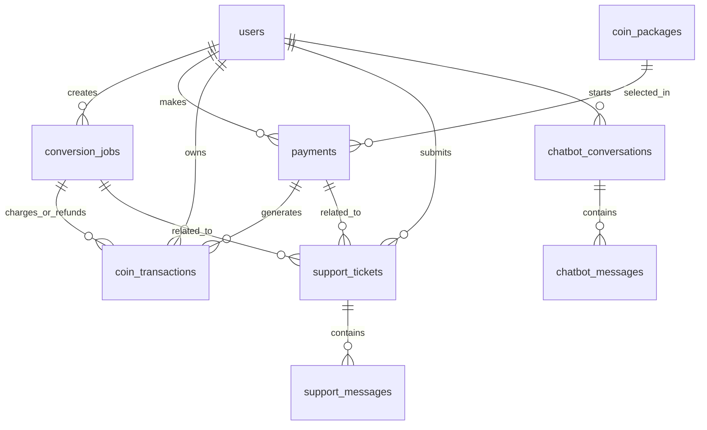

# Thiết kế cơ sở dữ liệu cho website Convert PDF to Word

Database Design Specification (DB Design / ERD)

Tài liệu này mô tả thiết kế cơ sở dữ liệu cho website cho phép upload PDF, convert sang DOCX, quản lý coin, nạp coin, lịch sử chuyển đổi, chatbot AI, hỗ trợ viên và khiếu nại.

Thiết kế dưới đây phù hợp cho **MySQL 8+**. Nếu dùng PostgreSQL, có thể đổi `ENUM` thành `VARCHAR` hoặc tạo enum type riêng.

---

## 1. Tổng quan thiết kế

Hệ thống gồm các nhóm dữ liệu chính:

1. **Người dùng và phân quyền**

   - Quản lý tài khoản người dùng, admin, hỗ trợ viên.
   - Quản lý trạng thái tài khoản và số dư coin.
2. **Convert PDF sang Word**

   - Lưu thông tin file upload.
   - Lưu thông tin file kết quả.
   - Lưu chế độ chuyển đổi: miễn phí hoặc nâng cao.
   - Lưu loại xử lý: thường hoặc OCR.
   - Lưu trạng thái xử lý: chờ xử lý, đang xử lý, thành công, thất bại.
3. **Coin và giao dịch coin**

   - Quản lý số dư coin.
   - Lưu lịch sử cộng coin, trừ coin, hoàn coin, điều chỉnh coin thủ công.
4. **Nạp tiền mua coin**

   - Quản lý gói coin.
   - Lưu lịch sử thanh toán.
   - Cộng coin khi thanh toán thành công.
5. **Giới hạn convert miễn phí**

   - Kiểm soát số lần convert miễn phí mỗi ngày.
   - Áp dụng cho cả user đã đăng nhập và khách chưa đăng nhập.
6. **Hỗ trợ, khiếu nại và chatbot AI**

   - Lưu hội thoại chatbot.
   - Lưu khiếu nại của người dùng.
   - Lưu tin nhắn giữa người dùng và hỗ trợ viên.
7. **Cấu hình hệ thống**

   - Lưu các giới hạn như dung lượng file miễn phí, số trang miễn phí, số lần miễn phí mỗi ngày.
   - Lưu cấu hình giá coin cho từng loại convert.

---

## 2. Quy ước đặt tên

- Tên bảng dùng dạng số nhiều, ví dụ: `users`, `conversion_jobs`, `payments`.
- Khóa chính dùng tên `id`.
- Khóa ngoại dùng dạng `{table_singular}_id`, ví dụ: `user_id`, `payment_id`.
- Các cột thời gian:
  - `created_at`: thời điểm tạo bản ghi.
  - `updated_at`: thời điểm cập nhật bản ghi.
  - `deleted_at`: thời điểm xóa mềm nếu có.
- Các file lưu trong database chỉ nên lưu **đường dẫn hoặc URL**, không lưu trực tiếp nội dung file trong database.

---

## 3. Sơ đồ quan hệ tổng quát



---

## 4. Danh sách bảng đề xuất

| STT | Tên bảng                 | Mục đích                                                            |
| --: | -------------------------- | ---------------------------------------------------------------------- |
|   1 | `users`                  | Lưu tài khoản người dùng, admin, hỗ trợ viên và số dư coin |
|   2 | `password_reset_tokens`  | Lưu token quên mật khẩu                                            |
|   3 | `coin_packages`          | Lưu các gói coin người dùng có thể mua                         |
|   4 | `payments`               | Lưu giao dịch nạp tiền mua coin                                    |
|   5 | `conversion_jobs`        | Lưu thông tin file PDF, file DOCX và trạng thái convert           |
|   6 | `coin_transactions`      | Lưu lịch sử cộng, trừ, hoàn và điều chỉnh coin               |
|   7 | `free_conversion_usages` | Lưu số lần convert miễn phí theo ngày                            |
|   8 | `support_tickets`        | Lưu yêu cầu hỗ trợ hoặc khiếu nại                              |
|   9 | `support_messages`       | Lưu tin nhắn trong từng yêu cầu hỗ trợ                          |
|  10 | `chatbot_conversations`  | Lưu phiên hội thoại chatbot AI                                     |
|  11 | `chatbot_messages`       | Lưu nội dung hỏi đáp với chatbot AI                              |
|  12 | `system_settings`        | Lưu cấu hình hệ thống                                             |
|  13 | `admin_audit_logs`       | Lưu lịch sử thao tác quan trọng của admin/support                |

---

# 5. Thiết kế chi tiết từng bảng

---

## 5.1. Bảng `users`

Lưu thông tin tài khoản người dùng, admin và hỗ trợ viên.

### Chức năng liên quan

- Đăng ký, đăng nhập.
- Cập nhật thông tin cá nhân.
- Xem số dư coin.
- Phân quyền admin, support, user.
- Quản lý tài khoản.

### Cấu trúc bảng

| Cột              | Kiểu dữ liệu | Ràng buộc         | Mô tả                            |
| ----------------- | --------------- | ------------------- | ---------------------------------- |
| `id`            | BIGINT UNSIGNED | PK, AUTO_INCREMENT  | ID người dùng                   |
| `full_name`     | VARCHAR(150)    | NULL                | Họ tên                           |
| `email`         | VARCHAR(255)    | NOT NULL, UNIQUE    | Email đăng nhập                 |
| `password_hash` | VARCHAR(255)    | NOT NULL            | Mật khẩu đã mã hóa           |
| `role`          | ENUM            | NOT NULL            | `USER`, `ADMIN`, `SUPPORT`   |
| `coin_balance`  | INT UNSIGNED    | NOT NULL, DEFAULT 0 | Số dư coin hiện tại            |
| `status`        | ENUM            | NOT NULL            | `ACTIVE`, `LOCKED`, `BANNED` |
| `last_login_at` | DATETIME        | NULL                | Lần đăng nhập gần nhất       |
| `created_at`    | DATETIME        | NOT NULL            | Ngày tạo                         |
| `updated_at`    | DATETIME        | NOT NULL            | Ngày cập nhật                   |

### Ghi chú

- `coin_balance` được lưu trực tiếp để đọc nhanh.
- Mọi thay đổi coin vẫn phải được ghi vào bảng `coin_transactions`.
- Khi cộng/trừ coin, nên dùng database transaction để tránh sai lệch số dư.

---

## 5.2. Bảng `password_reset_tokens`

Lưu token phục vụ chức năng quên mật khẩu.

| Cột           | Kiểu dữ liệu | Ràng buộc        | Mô tả                                  |
| -------------- | --------------- | ------------------ | ---------------------------------------- |
| `id`         | BIGINT UNSIGNED | PK, AUTO_INCREMENT | ID token                                 |
| `user_id`    | BIGINT UNSIGNED | FK, NOT NULL       | Người dùng yêu cầu đổi mật khẩu |
| `token_hash` | VARCHAR(255)    | NOT NULL           | Token đã hash                          |
| `expires_at` | DATETIME        | NOT NULL           | Thời gian hết hạn                     |
| `used_at`    | DATETIME        | NULL               | Thời gian đã sử dụng                |
| `created_at` | DATETIME        | NOT NULL           | Ngày tạo                               |

### Ghi chú

- Không nên lưu token dạng plain text.
- Token nên hết hạn sau một khoảng thời gian ngắn, ví dụ 15 đến 30 phút.

---

## 5.3. Bảng `coin_packages`

Lưu các gói coin để người dùng chọn khi nạp tiền.

### Chức năng liên quan

- Hiển thị các gói coin.
- Admin quản lý gói coin.
- Người dùng chọn gói coin để thanh toán.

| Cột            | Kiểu dữ liệu | Ràng buộc            | Mô tả                   |
| --------------- | --------------- | ---------------------- | ------------------------- |
| `id`          | BIGINT UNSIGNED | PK, AUTO_INCREMENT     | ID gói coin              |
| `name`        | VARCHAR(100)    | NOT NULL               | Tên gói                 |
| `price_vnd`   | INT UNSIGNED    | NOT NULL               | Giá tiền VNĐ           |
| `coin_amount` | INT UNSIGNED    | NOT NULL               | Số coin nhận được    |
| `description` | TEXT            | NULL                   | Mô tả gói              |
| `is_active`   | BOOLEAN         | NOT NULL, DEFAULT TRUE | Gói còn bán hay không |
| `sort_order`  | INT             | NOT NULL, DEFAULT 0    | Thứ tự hiển thị       |
| `created_at`  | DATETIME        | NOT NULL               | Ngày tạo                |
| `updated_at`  | DATETIME        | NOT NULL               | Ngày cập nhật          |

### Dữ liệu mẫu

| name   | price_vnd | coin_amount |
| ------ | --------: | ----------: |
| Gói 1 |     10000 |         100 |
| Gói 2 |     50000 |         600 |
| Gói 3 |    100000 |        1500 |

---

## 5.4. Bảng `payments`

Lưu lịch sử nạp tiền mua coin.

### Chức năng liên quan

- Người dùng nạp coin.
- Hệ thống nhận kết quả thanh toán.
- Admin xem danh sách giao dịch nạp tiền.
- Thống kê lượng nạp coin và doanh thu.

| Cột                          | Kiểu dữ liệu | Ràng buộc        | Mô tả                                                         |
| ----------------------------- | --------------- | ------------------ | --------------------------------------------------------------- |
| `id`                        | BIGINT UNSIGNED | PK, AUTO_INCREMENT | ID thanh toán                                                  |
| `user_id`                   | BIGINT UNSIGNED | FK, NOT NULL       | Người dùng nạp tiền                                        |
| `coin_package_id`           | BIGINT UNSIGNED | FK, NULL           | Gói coin được chọn                                         |
| `amount_vnd`                | INT UNSIGNED    | NOT NULL           | Số tiền thanh toán                                           |
| `coin_amount`               | INT UNSIGNED    | NOT NULL           | Số coin được cộng nếu thành công                        |
| `payment_method`            | ENUM            | NOT NULL           | `MANUAL`, `BANK_TRANSFER`, `MOMO`, `VNPAY`, `ZALOPAY` |
| `status`                    | ENUM            | NOT NULL           | `PENDING`, `SUCCESS`, `FAILED`, `CANCELED`              |
| `provider_transaction_code` | VARCHAR(255)    | NULL               | Mã giao dịch từ cổng thanh toán                            |
| `payment_content`           | VARCHAR(255)    | NULL               | Nội dung thanh toán                                           |
| `note`                      | TEXT            | NULL               | Ghi chú                                                        |
| `paid_at`                   | DATETIME        | NULL               | Thời điểm thanh toán thành công                           |
| `created_at`                | DATETIME        | NOT NULL           | Ngày tạo                                                      |
| `updated_at`                | DATETIME        | NOT NULL           | Ngày cập nhật                                                |

### Ghi chú

- Khi `status = SUCCESS`, hệ thống tạo một bản ghi `coin_transactions` loại `ADD`.
- Nên có ràng buộc không cộng coin hai lần cho cùng một thanh toán.

---

## 5.5. Bảng `conversion_jobs`

Lưu thông tin mỗi lần người dùng convert PDF sang DOCX.

### Chức năng liên quan

- Upload PDF.
- Convert miễn phí.
- Convert nâng cao tốn coin.
- OCR.
- Hàng đợi xử lý file.
- Tải file sau khi convert.
- Lịch sử chuyển đổi.
- Theo dõi lỗi convert.

| Cột                   | Kiểu dữ liệu  | Ràng buộc         | Mô tả                                                                        |
| ---------------------- | ---------------- | ------------------- | ------------------------------------------------------------------------------ |
| `id`                 | BIGINT UNSIGNED  | PK, AUTO_INCREMENT  | ID lần convert                                                                |
| `request_code`       | VARCHAR(64)      | NOT NULL, UNIQUE    | Mã yêu cầu convert, chống xử lý trùng                                   |
| `user_id`            | BIGINT UNSIGNED  | FK, NULL            | Người dùng convert, NULL nếu là khách                                    |
| `guest_token`        | VARCHAR(100)     | NULL                | Mã định danh khách chưa đăng nhập                                      |
| `source_ip`          | VARCHAR(45)      | NULL                | IP người dùng                                                               |
| `original_file_name` | VARCHAR(255)     | NOT NULL            | Tên file PDF gốc                                                             |
| `original_file_path` | VARCHAR(500)     | NOT NULL            | Đường dẫn lưu file PDF                                                    |
| `output_file_name`   | VARCHAR(255)     | NULL                | Tên file DOCX kết quả                                                       |
| `output_file_path`   | VARCHAR(500)     | NULL                | Đường dẫn lưu file DOCX                                                   |
| `file_size_bytes`    | BIGINT UNSIGNED  | NOT NULL            | Dung lượng file PDF                                                          |
| `total_pages`        | INT UNSIGNED     | NOT NULL            | Số trang PDF                                                                  |
| `conversion_mode`    | ENUM             | NOT NULL            | `FREE`, `PREMIUM`                                                          |
| `processing_type`    | ENUM             | NOT NULL            | `NORMAL`, `OCR`                                                            |
| `coin_estimated`     | INT UNSIGNED     | NOT NULL, DEFAULT 0 | Coin dự kiến                                                                 |
| `coin_charged`       | INT UNSIGNED     | NOT NULL, DEFAULT 0 | Coin thực tế đã trừ                                                       |
| `status`             | ENUM             | NOT NULL            | `PENDING`, `PROCESSING`, `SUCCESS`, `FAILED`, `EXPIRED`, `DELETED` |
| `queue_priority`     | TINYINT UNSIGNED | NOT NULL, DEFAULT 5 | Độ ưu tiên xử lý, số nhỏ ưu tiên cao hơn                            |
| `error_message`      | TEXT             | NULL                | Thông báo lỗi nếu thất bại                                               |
| `started_at`         | DATETIME         | NULL                | Thời điểm bắt đầu xử lý                                                |
| `completed_at`       | DATETIME         | NULL                | Thời điểm hoàn tất                                                        |
| `file_expired_at`    | DATETIME         | NULL                | Thời điểm file hết hạn                                                    |
| `deleted_at`         | DATETIME         | NULL                | Thời điểm file bị xóa                                                     |
| `created_at`         | DATETIME         | NOT NULL            | Ngày tạo                                                                     |
| `updated_at`         | DATETIME         | NOT NULL            | Ngày cập nhật                                                               |

### Quy tắc nghiệp vụ

- Convert miễn phí:
  - `conversion_mode = FREE`
  - `coin_estimated = 0`
  - `coin_charged = 0`
  - File kết quả lưu 1 giờ.
- Convert nâng cao:
  - `conversion_mode = PREMIUM`
  - Cần kiểm tra số dư coin.
  - File kết quả lưu 24 giờ.
- Nếu convert thất bại:
  - `status = FAILED`
  - Nếu đã trừ coin thì tạo giao dịch hoàn coin trong `coin_transactions`.
- Nếu file hết hạn:
  - `status = EXPIRED` hoặc giữ trạng thái `SUCCESS` và chỉ dựa vào `file_expired_at`.
  - Khi file bị xóa vật lý khỏi storage thì cập nhật `deleted_at`.

---

## 5.6. Bảng `coin_transactions`

Lưu toàn bộ lịch sử biến động coin.

### Chức năng liên quan

- Xem lịch sử cộng coin.
- Xem lịch sử trừ coin.
- Hoàn coin khi convert lỗi.
- Admin cộng/trừ coin thủ công.
- Đối chiếu khi có khiếu nại.

| Cột                  | Kiểu dữ liệu | Ràng buộc        | Mô tả                                            |
| --------------------- | --------------- | ------------------ | -------------------------------------------------- |
| `id`                | BIGINT UNSIGNED | PK, AUTO_INCREMENT | ID giao dịch coin                                 |
| `transaction_code`  | VARCHAR(64)     | NOT NULL, UNIQUE   | Mã giao dịch coin                                |
| `user_id`           | BIGINT UNSIGNED | FK, NOT NULL       | Người sở hữu giao dịch                        |
| `payment_id`        | BIGINT UNSIGNED | FK, NULL           | Thanh toán liên quan nếu có                    |
| `conversion_job_id` | BIGINT UNSIGNED | FK, NULL           | Lần convert liên quan nếu có                   |
| `type`              | ENUM            | NOT NULL           | `ADD`, `DEDUCT`, `REFUND`, `ADJUST`        |
| `amount`            | INT UNSIGNED    | NOT NULL           | Số coin thay đổi                                |
| `balance_before`    | INT UNSIGNED    | NOT NULL           | Số dư trước giao dịch                         |
| `balance_after`     | INT UNSIGNED    | NOT NULL           | Số dư sau giao dịch                             |
| `reason`            | VARCHAR(255)    | NOT NULL           | Lý do giao dịch                                  |
| `status`            | ENUM            | NOT NULL           | `PENDING`, `SUCCESS`, `FAILED`, `CANCELED` |
| `created_by`        | BIGINT UNSIGNED | FK, NULL           | Admin/support tạo giao dịch nếu là thủ công  |
| `created_at`        | DATETIME        | NOT NULL           | Ngày tạo                                         |

### Quy tắc nghiệp vụ

- Khi nạp coin thành công: tạo giao dịch `ADD`.
- Khi convert nâng cao thành công: tạo giao dịch `DEDUCT`.
- Khi convert lỗi sau khi đã trừ coin: tạo giao dịch `REFUND`.
- Khi admin điều chỉnh coin: tạo giao dịch `ADJUST`.
- Không cập nhật `users.coin_balance` mà không ghi `coin_transactions`.

---

## 5.7. Bảng `free_conversion_usages`

Lưu số lần convert miễn phí trong ngày.

### Chức năng liên quan

- Giới hạn 5 lần convert miễn phí mỗi ngày.
- Áp dụng cho user đã đăng nhập hoặc khách chưa đăng nhập.
- Chống lạm dụng chế độ miễn phí.

| Cột               | Kiểu dữ liệu | Ràng buộc         | Mô tả                       |
| ------------------ | --------------- | ------------------- | ----------------------------- |
| `id`             | BIGINT UNSIGNED | PK, AUTO_INCREMENT  | ID bản ghi                   |
| `identity_type`  | ENUM            | NOT NULL            | `USER`, `GUEST`, `IP`   |
| `identity_value` | VARCHAR(255)    | NOT NULL            | ID user, guest token hoặc IP |
| `usage_date`     | DATE            | NOT NULL            | Ngày sử dụng               |
| `used_count`     | INT UNSIGNED    | NOT NULL, DEFAULT 0 | Số lần đã dùng           |
| `daily_limit`    | INT UNSIGNED    | NOT NULL, DEFAULT 5 | Giới hạn mỗi ngày         |
| `created_at`     | DATETIME        | NOT NULL            | Ngày tạo                    |
| `updated_at`     | DATETIME        | NOT NULL            | Ngày cập nhật              |

### Ràng buộc quan trọng

- Unique: `identity_type`, `identity_value`, `usage_date`.
- Khi người dùng convert miễn phí thành công hoặc bắt đầu xử lý, tăng `used_count`.
- Nên tăng trong transaction để tránh vượt giới hạn khi gửi nhiều yêu cầu cùng lúc.

---

## 5.8. Bảng `support_tickets`

Lưu yêu cầu hỗ trợ hoặc khiếu nại của người dùng.

### Chức năng liên quan

- Người dùng gửi khiếu nại.
- Người dùng nhắn tin với hỗ trợ viên.
- Hỗ trợ viên quản lý và phản hồi khiếu nại.
- Admin theo dõi các vấn đề liên quan đến convert, coin, thanh toán.

| Cột                          | Kiểu dữ liệu | Ràng buộc        | Mô tả                                                                            |
| ----------------------------- | --------------- | ------------------ | ---------------------------------------------------------------------------------- |
| `id`                        | BIGINT UNSIGNED | PK, AUTO_INCREMENT | ID ticket                                                                          |
| `ticket_code`               | VARCHAR(64)     | NOT NULL, UNIQUE   | Mã khiếu nại                                                                    |
| `user_id`                   | BIGINT UNSIGNED | FK, NOT NULL       | Người tạo ticket                                                                |
| `assigned_support_id`       | BIGINT UNSIGNED | FK, NULL           | Hỗ trợ viên phụ trách                                                         |
| `related_payment_id`        | BIGINT UNSIGNED | FK, NULL           | Thanh toán liên quan                                                             |
| `related_conversion_job_id` | BIGINT UNSIGNED | FK, NULL           | Lần convert liên quan                                                            |
| `title`                     | VARCHAR(255)    | NOT NULL           | Tiêu đề                                                                         |
| `content`                   | TEXT            | NOT NULL           | Nội dung ban đầu                                                                |
| `issue_type`                | ENUM            | NOT NULL           | `CONVERT_ERROR`, `PAYMENT_ERROR`, `COIN_ERROR`, `ACCOUNT_ERROR`, `OTHER` |
| `priority`                  | ENUM            | NOT NULL           | `LOW`, `NORMAL`, `HIGH`, `URGENT`                                          |
| `status`                    | ENUM            | NOT NULL           | `NEW`, `IN_PROGRESS`, `REPLIED`, `RESOLVED`, `CANCELED`                  |
| `created_at`                | DATETIME        | NOT NULL           | Ngày tạo                                                                         |
| `updated_at`                | DATETIME        | NOT NULL           | Ngày cập nhật                                                                   |
| `resolved_at`               | DATETIME        | NULL               | Ngày hoàn tất                                                                   |

### Ghi chú

- `assigned_support_id` trỏ tới `users.id` có role `SUPPORT` hoặc `ADMIN`.
- Ticket có thể liên kết với một lần convert hoặc một thanh toán cụ thể.

---

## 5.9. Bảng `support_messages`

Lưu tin nhắn trong từng cuộc hỗ trợ/khiếu nại.

| Cột                  | Kiểu dữ liệu | Ràng buộc             | Mô tả                                               |
| --------------------- | --------------- | ----------------------- | ----------------------------------------------------- |
| `id`                | BIGINT UNSIGNED | PK, AUTO_INCREMENT      | ID tin nhắn                                          |
| `support_ticket_id` | BIGINT UNSIGNED | FK, NOT NULL            | Ticket chứa tin nhắn                                |
| `sender_id`         | BIGINT UNSIGNED | FK, NULL                | Người gửi, NULL nếu là hệ thống/bot            |
| `sender_role`       | ENUM            | NOT NULL                | `USER`, `SUPPORT`, `ADMIN`, `BOT`, `SYSTEM` |
| `message`           | TEXT            | NOT NULL                | Nội dung tin nhắn                                   |
| `attachment_path`   | VARCHAR(500)    | NULL                    | File đính kèm nếu có                             |
| `is_read`           | BOOLEAN         | NOT NULL, DEFAULT FALSE | Trạng thái đã đọc                               |
| `created_at`        | DATETIME        | NOT NULL                | Thời gian gửi                                       |

---

## 5.10. Bảng `chatbot_conversations`

Lưu phiên hội thoại chatbot AI.

| Cột            | Kiểu dữ liệu | Ràng buộc        | Mô tả                             |
| --------------- | --------------- | ------------------ | ----------------------------------- |
| `id`          | BIGINT UNSIGNED | PK, AUTO_INCREMENT | ID phiên chat                      |
| `user_id`     | BIGINT UNSIGNED | FK, NULL           | Người dùng, NULL nếu là khách |
| `guest_token` | VARCHAR(100)    | NULL               | Mã định danh khách              |
| `status`      | ENUM            | NOT NULL           | `OPEN`, `CLOSED`, `ESCALATED` |
| `created_at`  | DATETIME        | NOT NULL           | Ngày tạo                          |
| `updated_at`  | DATETIME        | NOT NULL           | Ngày cập nhật                    |

### Ghi chú

- Khi chatbot không xử lý được, có thể chuyển sang ticket hỗ trợ.
- Khi chuyển sang ticket, cập nhật `status = ESCALATED`.

---

## 5.11. Bảng `chatbot_messages`

Lưu từng câu hỏi và câu trả lời trong chatbot.

| Cột                        | Kiểu dữ liệu  | Ràng buộc        | Mô tả                                 |
| --------------------------- | ---------------- | ------------------ | --------------------------------------- |
| `id`                      | BIGINT UNSIGNED  | PK, AUTO_INCREMENT | ID tin nhắn chatbot                    |
| `chatbot_conversation_id` | BIGINT UNSIGNED  | FK, NOT NULL       | Phiên chat                             |
| `sender_role`             | ENUM             | NOT NULL           | `USER`, `BOT`, `SYSTEM`           |
| `message`                 | TEXT             | NOT NULL           | Nội dung                               |
| `rating`                  | TINYINT UNSIGNED | NULL               | Đánh giá câu trả lời, ví dụ 1-5 |
| `created_at`              | DATETIME         | NOT NULL           | Thời gian gửi                         |

---

## 5.12. Bảng `system_settings`

Lưu cấu hình hệ thống để admin có thể thay đổi mà không cần sửa code.

### Ví dụ cấu hình

| setting_key                      | setting_value | Ý nghĩa                                  |
| -------------------------------- | ------------- | ------------------------------------------ |
| `free_max_file_size_mb`        | `5`         | Dung lượng tối đa chế độ miễn phí |
| `free_max_pages`               | `30`        | Số trang tối đa chế độ miễn phí    |
| `free_daily_limit`             | `5`         | Số lần convert miễn phí mỗi ngày     |
| `free_file_storage_hours`      | `1`         | Thời gian lưu file miễn phí            |
| `premium_file_storage_hours`   | `24`        | Thời gian lưu file nâng cao             |
| `coin_normal_per_page`         | `1`         | Coin cho convert thường                  |
| `coin_ocr_per_page`            | `2`         | Coin cho convert OCR                       |
| `coin_after_30_pages_per_page` | `3`         | Coin cho mỗi trang sau trang 30           |

### Cấu trúc bảng

| Cột              | Kiểu dữ liệu | Ràng buộc        | Mô tả                                    |
| ----------------- | --------------- | ------------------ | ------------------------------------------ |
| `id`            | BIGINT UNSIGNED | PK, AUTO_INCREMENT | ID cấu hình                              |
| `setting_key`   | VARCHAR(100)    | NOT NULL, UNIQUE   | Tên cấu hình                            |
| `setting_value` | VARCHAR(500)    | NOT NULL           | Giá trị cấu hình                       |
| `data_type`     | ENUM            | NOT NULL           | `STRING`, `INT`, `BOOLEAN`, `JSON` |
| `description`   | VARCHAR(255)    | NULL               | Mô tả                                    |
| `updated_by`    | BIGINT UNSIGNED | FK, NULL           | Admin cập nhật                           |
| `created_at`    | DATETIME        | NOT NULL           | Ngày tạo                                 |
| `updated_at`    | DATETIME        | NOT NULL           | Ngày cập nhật                           |

---

## 5.13. Bảng `admin_audit_logs`

Lưu lịch sử thao tác quan trọng của admin hoặc hỗ trợ viên.

### Chức năng liên quan

- Theo dõi admin thay đổi gói coin.
- Theo dõi admin cộng/trừ coin thủ công.
- Theo dõi thay đổi cấu hình hệ thống.
- Hỗ trợ kiểm tra khi có lỗi hoặc khiếu nại.

| Cột             | Kiểu dữ liệu | Ràng buộc        | Mô tả                     |
| ---------------- | --------------- | ------------------ | --------------------------- |
| `id`           | BIGINT UNSIGNED | PK, AUTO_INCREMENT | ID log                      |
| `actor_id`     | BIGINT UNSIGNED | FK, NULL           | Người thực hiện         |
| `action`       | VARCHAR(100)    | NOT NULL           | Hành động                |
| `target_table` | VARCHAR(100)    | NULL               | Bảng bị tác động       |
| `target_id`    | BIGINT UNSIGNED | NULL               | ID bản ghi bị tác động |
| `old_value`    | JSON            | NULL               | Dữ liệu cũ               |
| `new_value`    | JSON            | NULL               | Dữ liệu mới              |
| `source_ip`    | VARCHAR(45)     | NULL               | IP thực hiện              |
| `created_at`   | DATETIME        | NOT NULL           | Thời gian thực hiện      |

---

# 6. SQL DDL tham khảo

> Lưu ý: DDL này dùng cho MySQL 8+. Có thể điều chỉnh enum, index hoặc kiểu dữ liệu theo framework/backend bạn dùng.

```sql
CREATE TABLE users (
    id BIGINT UNSIGNED AUTO_INCREMENT PRIMARY KEY,
    full_name VARCHAR(150) NULL,
    email VARCHAR(255) NOT NULL UNIQUE,
    password_hash VARCHAR(255) NOT NULL,
    role ENUM('USER', 'ADMIN', 'SUPPORT') NOT NULL DEFAULT 'USER',
    coin_balance INT UNSIGNED NOT NULL DEFAULT 0,
    status ENUM('ACTIVE', 'LOCKED', 'BANNED') NOT NULL DEFAULT 'ACTIVE',
    last_login_at DATETIME NULL,
    created_at DATETIME NOT NULL DEFAULT CURRENT_TIMESTAMP,
    updated_at DATETIME NOT NULL DEFAULT CURRENT_TIMESTAMP ON UPDATE CURRENT_TIMESTAMP
);

CREATE TABLE password_reset_tokens (
    id BIGINT UNSIGNED AUTO_INCREMENT PRIMARY KEY,
    user_id BIGINT UNSIGNED NOT NULL,
    token_hash VARCHAR(255) NOT NULL,
    expires_at DATETIME NOT NULL,
    used_at DATETIME NULL,
    created_at DATETIME NOT NULL DEFAULT CURRENT_TIMESTAMP,
    CONSTRAINT fk_password_reset_tokens_user
        FOREIGN KEY (user_id) REFERENCES users(id)
        ON DELETE CASCADE
);

CREATE TABLE coin_packages (
    id BIGINT UNSIGNED AUTO_INCREMENT PRIMARY KEY,
    name VARCHAR(100) NOT NULL,
    price_vnd INT UNSIGNED NOT NULL,
    coin_amount INT UNSIGNED NOT NULL,
    description TEXT NULL,
    is_active BOOLEAN NOT NULL DEFAULT TRUE,
    sort_order INT NOT NULL DEFAULT 0,
    created_at DATETIME NOT NULL DEFAULT CURRENT_TIMESTAMP,
    updated_at DATETIME NOT NULL DEFAULT CURRENT_TIMESTAMP ON UPDATE CURRENT_TIMESTAMP
);

CREATE TABLE payments (
    id BIGINT UNSIGNED AUTO_INCREMENT PRIMARY KEY,
    user_id BIGINT UNSIGNED NOT NULL,
    coin_package_id BIGINT UNSIGNED NULL,
    amount_vnd INT UNSIGNED NOT NULL,
    coin_amount INT UNSIGNED NOT NULL,
    payment_method ENUM('MANUAL', 'BANK_TRANSFER', 'MOMO', 'VNPAY', 'ZALOPAY') NOT NULL DEFAULT 'MANUAL',
    status ENUM('PENDING', 'SUCCESS', 'FAILED', 'CANCELED') NOT NULL DEFAULT 'PENDING',
    provider_transaction_code VARCHAR(255) NULL,
    payment_content VARCHAR(255) NULL,
    note TEXT NULL,
    paid_at DATETIME NULL,
    created_at DATETIME NOT NULL DEFAULT CURRENT_TIMESTAMP,
    updated_at DATETIME NOT NULL DEFAULT CURRENT_TIMESTAMP ON UPDATE CURRENT_TIMESTAMP,
    CONSTRAINT fk_payments_user
        FOREIGN KEY (user_id) REFERENCES users(id),
    CONSTRAINT fk_payments_coin_package
        FOREIGN KEY (coin_package_id) REFERENCES coin_packages(id)
);

CREATE TABLE conversion_jobs (
    id BIGINT UNSIGNED AUTO_INCREMENT PRIMARY KEY,
    request_code VARCHAR(64) NOT NULL UNIQUE,
    user_id BIGINT UNSIGNED NULL,
    guest_token VARCHAR(100) NULL,
    source_ip VARCHAR(45) NULL,
    original_file_name VARCHAR(255) NOT NULL,
    original_file_path VARCHAR(500) NOT NULL,
    output_file_name VARCHAR(255) NULL,
    output_file_path VARCHAR(500) NULL,
    file_size_bytes BIGINT UNSIGNED NOT NULL,
    total_pages INT UNSIGNED NOT NULL,
    conversion_mode ENUM('FREE', 'PREMIUM') NOT NULL,
    processing_type ENUM('NORMAL', 'OCR') NOT NULL DEFAULT 'NORMAL',
    coin_estimated INT UNSIGNED NOT NULL DEFAULT 0,
    coin_charged INT UNSIGNED NOT NULL DEFAULT 0,
    status ENUM('PENDING', 'PROCESSING', 'SUCCESS', 'FAILED', 'EXPIRED', 'DELETED') NOT NULL DEFAULT 'PENDING',
    queue_priority TINYINT UNSIGNED NOT NULL DEFAULT 5,
    error_message TEXT NULL,
    started_at DATETIME NULL,
    completed_at DATETIME NULL,
    file_expired_at DATETIME NULL,
    deleted_at DATETIME NULL,
    created_at DATETIME NOT NULL DEFAULT CURRENT_TIMESTAMP,
    updated_at DATETIME NOT NULL DEFAULT CURRENT_TIMESTAMP ON UPDATE CURRENT_TIMESTAMP,
    CONSTRAINT fk_conversion_jobs_user
        FOREIGN KEY (user_id) REFERENCES users(id)
        ON DELETE SET NULL
);

CREATE TABLE coin_transactions (
    id BIGINT UNSIGNED AUTO_INCREMENT PRIMARY KEY,
    transaction_code VARCHAR(64) NOT NULL UNIQUE,
    user_id BIGINT UNSIGNED NOT NULL,
    payment_id BIGINT UNSIGNED NULL,
    conversion_job_id BIGINT UNSIGNED NULL,
    type ENUM('ADD', 'DEDUCT', 'REFUND', 'ADJUST') NOT NULL,
    amount INT UNSIGNED NOT NULL,
    balance_before INT UNSIGNED NOT NULL,
    balance_after INT UNSIGNED NOT NULL,
    reason VARCHAR(255) NOT NULL,
    status ENUM('PENDING', 'SUCCESS', 'FAILED', 'CANCELED') NOT NULL DEFAULT 'SUCCESS',
    created_by BIGINT UNSIGNED NULL,
    created_at DATETIME NOT NULL DEFAULT CURRENT_TIMESTAMP,
    CONSTRAINT fk_coin_transactions_user
        FOREIGN KEY (user_id) REFERENCES users(id),
    CONSTRAINT fk_coin_transactions_payment
        FOREIGN KEY (payment_id) REFERENCES payments(id)
        ON DELETE SET NULL,
    CONSTRAINT fk_coin_transactions_conversion_job
        FOREIGN KEY (conversion_job_id) REFERENCES conversion_jobs(id)
        ON DELETE SET NULL,
    CONSTRAINT fk_coin_transactions_created_by
        FOREIGN KEY (created_by) REFERENCES users(id)
        ON DELETE SET NULL
);

CREATE TABLE free_conversion_usages (
    id BIGINT UNSIGNED AUTO_INCREMENT PRIMARY KEY,
    identity_type ENUM('USER', 'GUEST', 'IP') NOT NULL,
    identity_value VARCHAR(255) NOT NULL,
    usage_date DATE NOT NULL,
    used_count INT UNSIGNED NOT NULL DEFAULT 0,
    daily_limit INT UNSIGNED NOT NULL DEFAULT 5,
    created_at DATETIME NOT NULL DEFAULT CURRENT_TIMESTAMP,
    updated_at DATETIME NOT NULL DEFAULT CURRENT_TIMESTAMP ON UPDATE CURRENT_TIMESTAMP,
    UNIQUE KEY uk_free_usage_identity_date (identity_type, identity_value, usage_date)
);

CREATE TABLE support_tickets (
    id BIGINT UNSIGNED AUTO_INCREMENT PRIMARY KEY,
    ticket_code VARCHAR(64) NOT NULL UNIQUE,
    user_id BIGINT UNSIGNED NOT NULL,
    assigned_support_id BIGINT UNSIGNED NULL,
    related_payment_id BIGINT UNSIGNED NULL,
    related_conversion_job_id BIGINT UNSIGNED NULL,
    title VARCHAR(255) NOT NULL,
    content TEXT NOT NULL,
    issue_type ENUM('CONVERT_ERROR', 'PAYMENT_ERROR', 'COIN_ERROR', 'ACCOUNT_ERROR', 'OTHER') NOT NULL DEFAULT 'OTHER',
    priority ENUM('LOW', 'NORMAL', 'HIGH', 'URGENT') NOT NULL DEFAULT 'NORMAL',
    status ENUM('NEW', 'IN_PROGRESS', 'REPLIED', 'RESOLVED', 'CANCELED') NOT NULL DEFAULT 'NEW',
    created_at DATETIME NOT NULL DEFAULT CURRENT_TIMESTAMP,
    updated_at DATETIME NOT NULL DEFAULT CURRENT_TIMESTAMP ON UPDATE CURRENT_TIMESTAMP,
    resolved_at DATETIME NULL,
    CONSTRAINT fk_support_tickets_user
        FOREIGN KEY (user_id) REFERENCES users(id),
    CONSTRAINT fk_support_tickets_assigned_support
        FOREIGN KEY (assigned_support_id) REFERENCES users(id)
        ON DELETE SET NULL,
    CONSTRAINT fk_support_tickets_payment
        FOREIGN KEY (related_payment_id) REFERENCES payments(id)
        ON DELETE SET NULL,
    CONSTRAINT fk_support_tickets_conversion_job
        FOREIGN KEY (related_conversion_job_id) REFERENCES conversion_jobs(id)
        ON DELETE SET NULL
);

CREATE TABLE support_messages (
    id BIGINT UNSIGNED AUTO_INCREMENT PRIMARY KEY,
    support_ticket_id BIGINT UNSIGNED NOT NULL,
    sender_id BIGINT UNSIGNED NULL,
    sender_role ENUM('USER', 'SUPPORT', 'ADMIN', 'BOT', 'SYSTEM') NOT NULL,
    message TEXT NOT NULL,
    attachment_path VARCHAR(500) NULL,
    is_read BOOLEAN NOT NULL DEFAULT FALSE,
    created_at DATETIME NOT NULL DEFAULT CURRENT_TIMESTAMP,
    CONSTRAINT fk_support_messages_ticket
        FOREIGN KEY (support_ticket_id) REFERENCES support_tickets(id)
        ON DELETE CASCADE,
    CONSTRAINT fk_support_messages_sender
        FOREIGN KEY (sender_id) REFERENCES users(id)
        ON DELETE SET NULL
);

CREATE TABLE chatbot_conversations (
    id BIGINT UNSIGNED AUTO_INCREMENT PRIMARY KEY,
    user_id BIGINT UNSIGNED NULL,
    guest_token VARCHAR(100) NULL,
    status ENUM('OPEN', 'CLOSED', 'ESCALATED') NOT NULL DEFAULT 'OPEN',
    created_at DATETIME NOT NULL DEFAULT CURRENT_TIMESTAMP,
    updated_at DATETIME NOT NULL DEFAULT CURRENT_TIMESTAMP ON UPDATE CURRENT_TIMESTAMP,
    CONSTRAINT fk_chatbot_conversations_user
        FOREIGN KEY (user_id) REFERENCES users(id)
        ON DELETE SET NULL
);

CREATE TABLE chatbot_messages (
    id BIGINT UNSIGNED AUTO_INCREMENT PRIMARY KEY,
    chatbot_conversation_id BIGINT UNSIGNED NOT NULL,
    sender_role ENUM('USER', 'BOT', 'SYSTEM') NOT NULL,
    message TEXT NOT NULL,
    rating TINYINT UNSIGNED NULL,
    created_at DATETIME NOT NULL DEFAULT CURRENT_TIMESTAMP,
    CONSTRAINT fk_chatbot_messages_conversation
        FOREIGN KEY (chatbot_conversation_id) REFERENCES chatbot_conversations(id)
        ON DELETE CASCADE
);

CREATE TABLE system_settings (
    id BIGINT UNSIGNED AUTO_INCREMENT PRIMARY KEY,
    setting_key VARCHAR(100) NOT NULL UNIQUE,
    setting_value VARCHAR(500) NOT NULL,
    data_type ENUM('STRING', 'INT', 'BOOLEAN', 'JSON') NOT NULL DEFAULT 'STRING',
    description VARCHAR(255) NULL,
    updated_by BIGINT UNSIGNED NULL,
    created_at DATETIME NOT NULL DEFAULT CURRENT_TIMESTAMP,
    updated_at DATETIME NOT NULL DEFAULT CURRENT_TIMESTAMP ON UPDATE CURRENT_TIMESTAMP,
    CONSTRAINT fk_system_settings_updated_by
        FOREIGN KEY (updated_by) REFERENCES users(id)
        ON DELETE SET NULL
);

CREATE TABLE admin_audit_logs (
    id BIGINT UNSIGNED AUTO_INCREMENT PRIMARY KEY,
    actor_id BIGINT UNSIGNED NULL,
    action VARCHAR(100) NOT NULL,
    target_table VARCHAR(100) NULL,
    target_id BIGINT UNSIGNED NULL,
    old_value JSON NULL,
    new_value JSON NULL,
    source_ip VARCHAR(45) NULL,
    created_at DATETIME NOT NULL DEFAULT CURRENT_TIMESTAMP,
    CONSTRAINT fk_admin_audit_logs_actor
        FOREIGN KEY (actor_id) REFERENCES users(id)
        ON DELETE SET NULL
);
```

---

# 7. Index đề xuất

Các index dưới đây giúp tăng tốc truy vấn thường gặp.

```sql
CREATE INDEX idx_users_role ON users(role);
CREATE INDEX idx_users_status ON users(status);

CREATE INDEX idx_payments_user_id ON payments(user_id);
CREATE INDEX idx_payments_status ON payments(status);
CREATE INDEX idx_payments_created_at ON payments(created_at);

CREATE INDEX idx_conversion_jobs_user_id ON conversion_jobs(user_id);
CREATE INDEX idx_conversion_jobs_status ON conversion_jobs(status);
CREATE INDEX idx_conversion_jobs_mode ON conversion_jobs(conversion_mode);
CREATE INDEX idx_conversion_jobs_created_at ON conversion_jobs(created_at);
CREATE INDEX idx_conversion_jobs_file_expired_at ON conversion_jobs(file_expired_at);

CREATE INDEX idx_coin_transactions_user_id ON coin_transactions(user_id);
CREATE INDEX idx_coin_transactions_type ON coin_transactions(type);
CREATE INDEX idx_coin_transactions_created_at ON coin_transactions(created_at);
CREATE INDEX idx_coin_transactions_payment_id ON coin_transactions(payment_id);
CREATE INDEX idx_coin_transactions_conversion_job_id ON coin_transactions(conversion_job_id);

CREATE INDEX idx_support_tickets_user_id ON support_tickets(user_id);
CREATE INDEX idx_support_tickets_assigned_support_id ON support_tickets(assigned_support_id);
CREATE INDEX idx_support_tickets_status ON support_tickets(status);
CREATE INDEX idx_support_tickets_issue_type ON support_tickets(issue_type);

CREATE INDEX idx_support_messages_ticket_id ON support_messages(support_ticket_id);
CREATE INDEX idx_chatbot_messages_conversation_id ON chatbot_messages(chatbot_conversation_id);
```

---

# 8. Dữ liệu cấu hình ban đầu

Có thể thêm dữ liệu mặc định cho bảng `system_settings` và `coin_packages`.

```sql
INSERT INTO system_settings (setting_key, setting_value, data_type, description)
VALUES
('free_max_file_size_mb', '5', 'INT', 'Dung lượng file tối đa cho chế độ miễn phí'),
('free_max_pages', '30', 'INT', 'Số trang tối đa cho chế độ miễn phí'),
('free_daily_limit', '5', 'INT', 'Số lần convert miễn phí mỗi ngày'),
('free_file_storage_hours', '1', 'INT', 'Thời gian lưu file miễn phí'),
('premium_file_storage_hours', '24', 'INT', 'Thời gian lưu file nâng cao'),
('coin_normal_per_page', '1', 'INT', 'Coin cho convert thường mỗi trang'),
('coin_ocr_per_page', '2', 'INT', 'Coin cho convert OCR mỗi trang'),
('coin_after_30_pages_per_page', '3', 'INT', 'Coin cho mỗi trang sau trang 30');

INSERT INTO coin_packages (name, price_vnd, coin_amount, description, sort_order)
VALUES
('Gói 1', 10000, 100, 'Gói coin cơ bản', 1),
('Gói 2', 50000, 600, 'Gói coin tiết kiệm', 2),
('Gói 3', 100000, 1500, 'Gói coin nhiều ưu đãi', 3);
```

---

# 9. Quan hệ giữa các bảng

## 9.1. `users` và `conversion_jobs`

- Một user có thể có nhiều lần convert.
- Một lần convert có thể thuộc về user hoặc khách chưa đăng nhập.
- Quan hệ:
  - `users.id` → `conversion_jobs.user_id`

## 9.2. `users` và `payments`

- Một user có thể có nhiều giao dịch nạp tiền.
- Mỗi thanh toán thuộc về một user.
- Quan hệ:
  - `users.id` → `payments.user_id`

## 9.3. `payments` và `coin_transactions`

- Khi thanh toán thành công, hệ thống tạo giao dịch cộng coin.
- Một payment có thể tạo một giao dịch coin loại `ADD`.
- Quan hệ:
  - `payments.id` → `coin_transactions.payment_id`

## 9.4. `conversion_jobs` và `coin_transactions`

- Khi convert nâng cao thành công, hệ thống tạo giao dịch trừ coin.
- Khi convert lỗi sau khi đã trừ coin, hệ thống tạo giao dịch hoàn coin.
- Quan hệ:
  - `conversion_jobs.id` → `coin_transactions.conversion_job_id`

## 9.5. `support_tickets` và `support_messages`

- Một ticket có nhiều tin nhắn.
- Mỗi tin nhắn thuộc về một ticket.
- Quan hệ:
  - `support_tickets.id` → `support_messages.support_ticket_id`

## 9.6. `chatbot_conversations` và `chatbot_messages`

- Một phiên chatbot có nhiều tin nhắn.
- Mỗi tin nhắn thuộc về một phiên chatbot.
- Quan hệ:
  - `chatbot_conversations.id` → `chatbot_messages.chatbot_conversation_id`

---

# 10. Luồng dữ liệu chính

## 10.1. Luồng convert miễn phí

1. Tạo bản ghi trong `conversion_jobs` với:
   - `conversion_mode = FREE`
   - `coin_estimated = 0`
   - `coin_charged = 0`
   - `status = PENDING`
2. Kiểm tra hoặc tạo bản ghi trong `free_conversion_usages`.
3. Nếu chưa vượt giới hạn, tăng `used_count`.
4. Hệ thống xử lý convert.
5. Nếu thành công:
   - Cập nhật `conversion_jobs.status = SUCCESS`.
   - Cập nhật `output_file_path`.
   - Cập nhật `file_expired_at = thời điểm hiện tại + 1 giờ`.
6. Nếu thất bại:
   - Cập nhật `conversion_jobs.status = FAILED`.
   - Lưu `error_message`.

---

## 10.2. Luồng convert nâng cao bằng coin

1. Tạo bản ghi trong `conversion_jobs` với:
   - `conversion_mode = PREMIUM`
   - `coin_estimated` theo số trang và loại xử lý.
   - `status = PENDING`
2. Kiểm tra `users.coin_balance`.
3. Nếu không đủ coin, không cho tạo yêu cầu xử lý nâng cao hoặc cập nhật yêu cầu là thất bại.
4. Nếu đủ coin, đưa yêu cầu vào hàng đợi ưu tiên.
5. Khi convert thành công:
   - Trừ coin trong `users.coin_balance`.
   - Tạo bản ghi `coin_transactions` loại `DEDUCT`.
   - Cập nhật `conversion_jobs.coin_charged`.
   - Cập nhật `conversion_jobs.status = SUCCESS`.
   - Cập nhật `file_expired_at = thời điểm hiện tại + 24 giờ`.
6. Nếu convert thất bại:
   - Cập nhật `conversion_jobs.status = FAILED`.
   - Nếu trước đó đã trừ coin, tạo `coin_transactions` loại `REFUND`.

---

## 10.3. Luồng nạp coin

1. Người dùng chọn gói coin.
2. Tạo bản ghi trong `payments` với `status = PENDING`.
3. Người dùng thanh toán.
4. Hệ thống nhận kết quả thanh toán.
5. Nếu thành công:
   - Cập nhật `payments.status = SUCCESS`.
   - Cập nhật `payments.paid_at`.
   - Cộng coin vào `users.coin_balance`.
   - Tạo bản ghi `coin_transactions` loại `ADD`.
6. Nếu thất bại hoặc hủy:
   - Cập nhật `payments.status = FAILED` hoặc `CANCELED`.

---

## 10.4. Luồng khiếu nại/hỗ trợ

1. Người dùng tạo ticket trong `support_tickets`.
2. Nếu liên quan đến convert, lưu `related_conversion_job_id`.
3. Nếu liên quan đến thanh toán, lưu `related_payment_id`.
4. Người dùng và hỗ trợ viên trao đổi trong `support_messages`.
5. Khi xử lý xong, cập nhật `support_tickets.status = RESOLVED`.

---

# 11. Lưu ý triển khai quan trọng

## 11.1. Tránh trừ coin sai

Khi trừ coin, cần thực hiện trong database transaction:

```sql
START TRANSACTION;

SELECT coin_balance
FROM users
WHERE id = :user_id
FOR UPDATE;

-- Kiểm tra đủ coin ở tầng backend
-- Sau đó cập nhật số dư

UPDATE users
SET coin_balance = coin_balance - :coin_amount
WHERE id = :user_id
  AND coin_balance >= :coin_amount;

INSERT INTO coin_transactions (
    transaction_code,
    user_id,
    conversion_job_id,
    type,
    amount,
    balance_before,
    balance_after,
    reason,
    status
) VALUES (
    :transaction_code,
    :user_id,
    :conversion_job_id,
    'DEDUCT',
    :coin_amount,
    :balance_before,
    :balance_after,
    'Convert PDF to DOCX nâng cao',
    'SUCCESS'
);

COMMIT;
```

## 11.2. Tránh cộng coin hai lần

- `payments.provider_transaction_code` nên được kiểm tra trùng.
- `coin_transactions.transaction_code` phải unique.
- Khi nhận callback thanh toán, nếu payment đã `SUCCESS` thì không cộng coin lần nữa.

## 11.3. Tránh vượt giới hạn miễn phí

Khi tăng số lần convert miễn phí, nên dùng transaction hoặc câu SQL cập nhật có điều kiện.

```sql
UPDATE free_conversion_usages
SET used_count = used_count + 1
WHERE identity_type = :identity_type
  AND identity_value = :identity_value
  AND usage_date = CURRENT_DATE
  AND used_count < daily_limit;
```

Nếu số dòng bị ảnh hưởng bằng 0, nghĩa là người dùng đã vượt giới hạn hoặc chưa có bản ghi phù hợp.

## 11.4. Không lưu file trực tiếp trong database

Chỉ nên lưu:

- `original_file_path`
- `output_file_path`
- `attachment_path`

File thật nên lưu trong:

- Local storage của server.
- Object storage như S3, MinIO, Cloudflare R2.
- Hoặc dịch vụ cloud tương đương.

## 11.5. Tự động xóa file hết hạn

Nên có cron job hoặc background worker chạy định kỳ:

1. Tìm các bản ghi `conversion_jobs` có `file_expired_at < NOW()`.
2. Xóa file vật lý khỏi storage.
3. Cập nhật `deleted_at`.
4. Cập nhật `status = DELETED` hoặc `EXPIRED`.

---

# 12. Bảng tối thiểu cho phiên bản MVP

Nếu muốn làm bản đầu tiên đơn giản, có thể bắt đầu với các bảng sau:

1. `users`
2. `coin_packages`
3. `payments`
4. `conversion_jobs`
5. `coin_transactions`
6. `free_conversion_usages`
7. `support_tickets`
8. `support_messages`
9. `system_settings`

Các bảng chatbot và audit log có thể thêm ở phiên bản nâng cấp.

---

# 13. Gợi ý thứ tự tạo migration

Nên tạo bảng theo thứ tự sau để tránh lỗi khóa ngoại:

1. `users`
2. `password_reset_tokens`
3. `coin_packages`
4. `payments`
5. `conversion_jobs`
6. `coin_transactions`
7. `free_conversion_usages`
8. `support_tickets`
9. `support_messages`
10. `chatbot_conversations`
11. `chatbot_messages`
12. `system_settings`
13. `admin_audit_logs`

---

# 14. Kết luận

Thiết kế database trên đáp ứng các yêu cầu chính của hệ thống:

- Người dùng có thể đăng ký, đăng nhập và quản lý tài khoản.
- Người dùng có thể upload PDF và convert sang DOCX.
- Hệ thống hỗ trợ hai chế độ: miễn phí và nâng cao tốn coin.
- Hệ thống quản lý số dư coin và lịch sử giao dịch coin.
- Người dùng có thể nạp tiền mua coin.
- Admin có thể quản lý người dùng, gói coin, giao dịch, lịch sử convert và thống kê.
- Hỗ trợ viên có thể xử lý khiếu nại và nhắn tin với người dùng.
- Chatbot AI có thể hỗ trợ trả lời các câu hỏi cơ bản.
- Hệ thống có thể mở rộng thêm OCR, hàng đợi xử lý, thanh toán tự động và thống kê nâng cao.
