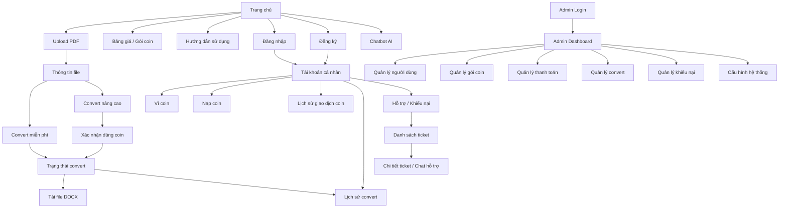
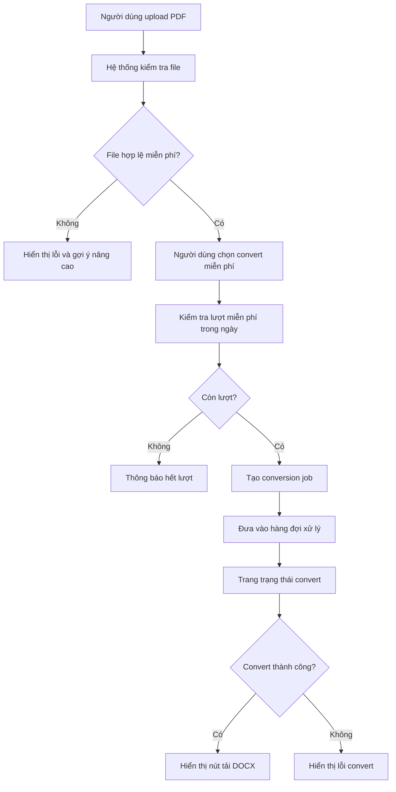
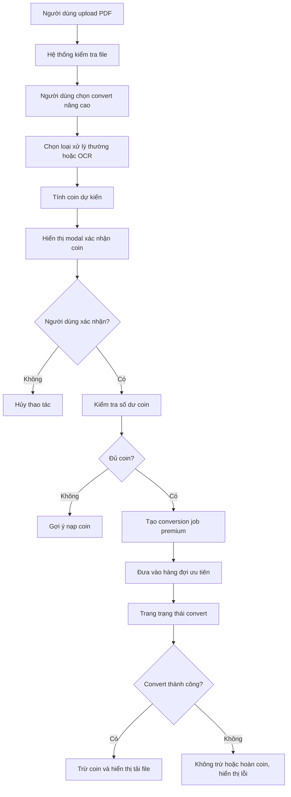
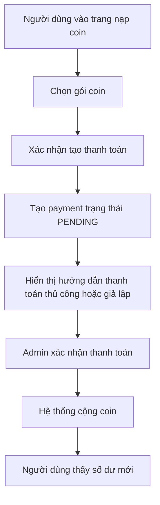
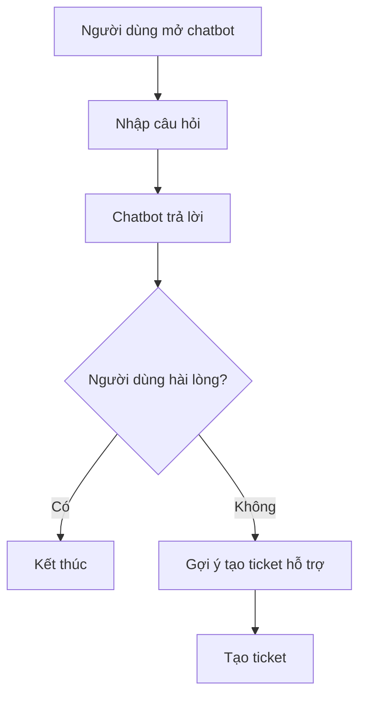
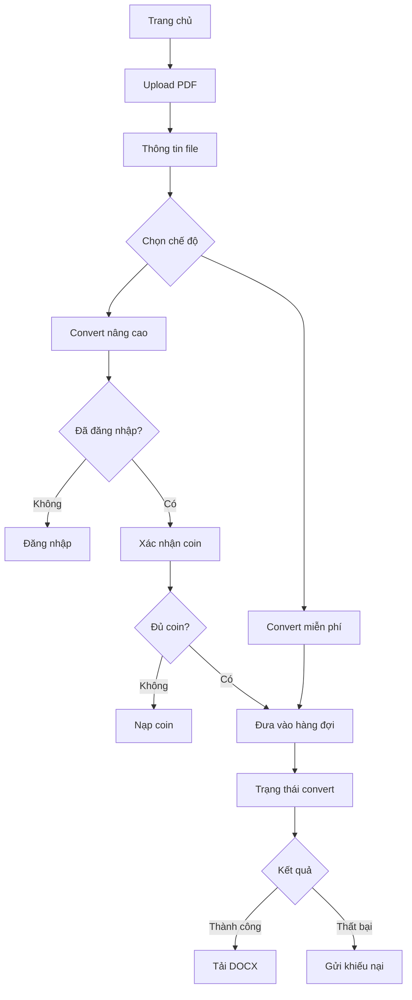
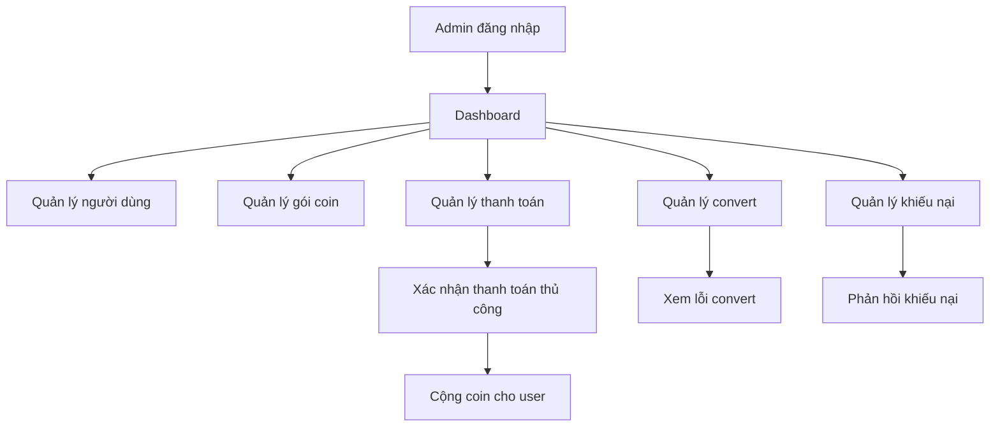

# UI Flow - Luồng giao diện website Convert PDF to Word

## 1. Mục đích tài liệu

Tài liệu này mô tả luồng giao diện cho website Convert PDF to Word, giúp xác định người dùng sẽ đi qua những màn hình nào, thao tác ra sao và mỗi màn hình cần hiển thị những thông tin gì.

Tài liệu này dùng làm cơ sở cho:

- Thiết kế wireframe/mockup.
- Xây dựng frontend bằng Next.js.
- Thiết kế API giữa frontend và backend.
- Kiểm tra luồng nghiệp vụ trước khi lập trình.
- Phân chia task cho frontend, backend và worker.

---

## 2. Tổng quan sản phẩm

Website cho phép người dùng upload file PDF và chuyển đổi sang file Word định dạng `.docx`.

Hệ thống có hai chế độ chuyển đổi:

- **Convert miễn phí**: không tốn coin, giới hạn dung lượng, số trang và số lần sử dụng mỗi ngày.
- **Convert nâng cao**: tốn coin, hỗ trợ file lớn hơn, có thể hỗ trợ OCR và được ưu tiên xử lý.

Ngoài chức năng convert, website còn có:

- Đăng ký, đăng nhập.
- Quản lý tài khoản.
- Ví coin.
- Nạp coin.
- Lịch sử convert.
- Lịch sử giao dịch coin.
- Khiếu nại/hỗ trợ.
- Chatbot AI.
- Trang admin.
- Trang hỗ trợ viên.

---

## 3. Vai trò người dùng và phạm vi giao diện

### 3.1. Khách chưa đăng nhập

Khách chưa đăng nhập có thể truy cập website nhưng chưa có tài khoản hoặc chưa đăng nhập.

Các màn hình khách có thể truy cập:

- Trang chủ.
- Trang upload PDF.
- Trang convert miễn phí nếu được cho phép.
- Trang kết quả convert miễn phí.
- Trang đăng nhập.
- Trang đăng ký.
- Trang quên mật khẩu.
- Trang bảng giá/gói dịch vụ.
- Trang hướng dẫn sử dụng.
- Chatbot AI.
- Trang gửi hỗ trợ cơ bản nếu hệ thống cho phép.

Giới hạn:

- Không dùng được convert nâng cao bằng coin.
- Không xem được lịch sử convert cá nhân.
- Không có ví coin.
- Không nạp coin.
- File miễn phí chỉ lưu trong 1 giờ.
- Có thể bị giới hạn theo IP hoặc guest token.

---

### 3.2. Người dùng đã đăng nhập

Người dùng đã đăng nhập có toàn bộ chức năng chính.

Các màn hình có thể truy cập:

- Trang chủ.
- Trang upload PDF.
- Trang chọn chế độ convert.
- Trang trạng thái convert.
- Trang tải file kết quả.
- Trang tài khoản cá nhân.
- Trang ví coin.
- Trang nạp coin.
- Trang lịch sử convert.
- Trang lịch sử giao dịch coin.
- Trang lịch sử thanh toán.
- Trang hỗ trợ/khiếu nại.
- Chatbot AI.

---

### 3.3. Hỗ trợ viên

Hỗ trợ viên dùng giao diện riêng để xử lý yêu cầu của người dùng.

Các màn hình chính:

- Dashboard hỗ trợ.
- Danh sách ticket/khiếu nại.
- Chi tiết ticket.
- Giao diện nhắn tin với người dùng.
- Lọc ticket theo trạng thái.
- Xem thông tin liên quan đến payment hoặc conversion job nếu ticket có liên kết.

---

### 3.4. Quản trị viên

Admin dùng giao diện quản trị để quản lý hệ thống.

Các màn hình chính:

- Dashboard admin.
- Quản lý người dùng.
- Quản lý gói coin.
- Quản lý giao dịch thanh toán.
- Quản lý lịch sử convert.
- Quản lý giao dịch coin.
- Quản lý khiếu nại/hỗ trợ.
- Quản lý hỗ trợ viên.
- Cấu hình hệ thống.
- Thống kê doanh thu, coin, lượt convert.
- Nhật ký thao tác admin.

---

## 4. Sitemap tổng quan



---

## 5. Danh sách màn hình người dùng

### 5.1. Trang chủ

#### Mục tiêu

Giới thiệu dịch vụ Convert PDF to Word và dẫn người dùng đến chức năng upload file.

#### Thành phần giao diện

- Header:
  - Logo.
  - Menu: Trang chủ, Bảng giá, Hướng dẫn, Hỗ trợ.
  - Nút đăng nhập/đăng ký nếu chưa đăng nhập.
  - Avatar hoặc menu tài khoản nếu đã đăng nhập.
- Hero section:
  - Tiêu đề chính: Convert PDF sang Word nhanh chóng.
  - Mô tả ngắn.
  - Nút chính: Upload PDF.
- Khu vực upload nhanh:
  - Kéo thả file PDF.
  - Nút chọn file.
- Giới thiệu hai chế độ:
  - Miễn phí.
  - Nâng cao bằng coin.
- Lợi ích:
  - Dễ sử dụng.
  - Hỗ trợ file PDF.
  - Có lịch sử chuyển đổi.
  - Bảo mật file.
  - Tự động xóa file sau thời gian hết hạn.
- Câu hỏi thường gặp.
- Footer.

#### Hành động chính

- Người dùng bấm **Upload PDF**.
- Người dùng kéo thả file vào khu vực upload.
- Người dùng xem bảng giá.
- Người dùng đăng nhập/đăng ký.

#### Điều hướng

- Upload file thành công → Trang thông tin file.
- Bấm đăng nhập → Trang đăng nhập.
- Bấm đăng ký → Trang đăng ký.
- Bấm bảng giá → Trang bảng giá.

---

### 5.2. Trang đăng ký

#### Mục tiêu

Cho phép người dùng tạo tài khoản.

#### Thành phần giao diện

- Form đăng ký:
  - Họ tên.
  - Email.
  - Mật khẩu.
  - Nhập lại mật khẩu.
- Checkbox đồng ý điều khoản.
- Nút đăng ký.
- Link chuyển sang đăng nhập.
- Hiển thị lỗi validate.

#### Validate

- Email không được để trống.
- Email đúng định dạng.
- Mật khẩu đủ độ dài tối thiểu.
- Nhập lại mật khẩu phải khớp.
- Email chưa tồn tại trong hệ thống.

#### Điều hướng

- Đăng ký thành công → Trang đăng nhập hoặc trang tài khoản.
- Đăng ký thất bại → Hiển thị lỗi.

---

### 5.3. Trang đăng nhập

#### Mục tiêu

Cho phép người dùng đăng nhập vào hệ thống.

#### Thành phần giao diện

- Form đăng nhập:
  - Email.
  - Mật khẩu.
- Checkbox ghi nhớ đăng nhập nếu cần.
- Nút đăng nhập.
- Link quên mật khẩu.
- Link đăng ký tài khoản.
- Hiển thị lỗi đăng nhập.

#### Điều hướng

- User đăng nhập thành công → Trang tài khoản hoặc trang upload.
- Admin đăng nhập thành công → Trang admin dashboard.
- Support đăng nhập thành công → Trang support dashboard.
- Sai tài khoản/mật khẩu → Hiển thị lỗi.

---

### 5.4. Trang quên mật khẩu

#### Mục tiêu

Cho phép người dùng yêu cầu đặt lại mật khẩu.

#### Thành phần giao diện

- Form nhập email.
- Nút gửi yêu cầu.
- Thông báo kiểm tra email.
- Link quay lại đăng nhập.

#### Điều hướng

- Gửi thành công → Hiển thị thông báo.
- Token hợp lệ → Trang đặt lại mật khẩu.
- Token hết hạn → Hiển thị lỗi.

---

## 6. Luồng upload và convert PDF

### 6.1. Trang upload PDF

#### Mục tiêu

Cho phép người dùng chọn hoặc kéo thả file PDF để upload.

#### Thành phần giao diện

- Khu vực drag & drop.
- Nút chọn file.
- Thông tin định dạng hỗ trợ.
- Mô tả giới hạn miễn phí:
  - File nhỏ hơn 5MB.
  - Dưới 30 trang.
  - Tối đa 5 lần mỗi ngày.
- Gợi ý đăng nhập để dùng chế độ nâng cao.
- Thông báo lỗi nếu file không hợp lệ.

#### Trạng thái giao diện

| Trạng thái | Mô tả |
|---|---|
| Empty | Chưa chọn file |
| File selected | Đã chọn file, hiển thị tên file |
| Uploading | Đang upload file |
| Uploaded | Upload thành công |
| Invalid | File không hợp lệ |
| Error | Upload lỗi |

#### Validate phía frontend

- File phải có đuôi `.pdf`.
- Dung lượng không vượt quá giới hạn hệ thống.
- Không cho upload nhiều file nếu MVP chỉ hỗ trợ một file.
- Hiển thị lỗi rõ ràng nếu chọn sai định dạng.

#### Điều hướng

- Upload thành công → Trang thông tin file.
- Upload lỗi → Giữ lại trang upload và hiển thị lỗi.

---

### 6.2. Trang thông tin file

#### Mục tiêu

Hiển thị thông tin file trước khi người dùng chọn chế độ convert.

#### Thành phần giao diện

- Tên file PDF.
- Dung lượng file.
- Số trang.
- Trạng thái kiểm tra file.
- Dự kiến phí coin.
- Cảnh báo nếu vượt giới hạn miễn phí.
- Hai lựa chọn:
  - Convert miễn phí.
  - Convert nâng cao.
- Nút xóa file/chọn file khác.

#### Hiển thị theo điều kiện

Nếu file hợp lệ với chế độ miễn phí:

- Hiển thị nút **Convert miễn phí**.
- Hiển thị số lần miễn phí còn lại trong ngày.

Nếu file vượt giới hạn miễn phí:

- Nút convert miễn phí bị vô hiệu hóa.
- Hiển thị lý do:
  - File lớn hơn 5MB.
  - File từ 30 trang trở lên.
  - Đã hết lượt miễn phí hôm nay.
- Gợi ý dùng convert nâng cao.

Nếu người dùng chưa đăng nhập:

- Convert nâng cao bị khóa.
- Hiển thị nút đăng nhập để dùng coin.

---

### 6.3. Modal chọn chế độ convert

#### Mục tiêu

Giúp người dùng hiểu sự khác nhau giữa hai chế độ.

#### Nội dung modal

| Tiêu chí | Miễn phí | Nâng cao |
|---|---|---|
| Chi phí | 0 coin | Tính theo số trang |
| Giới hạn dung lượng | Dưới 5MB | Cao hơn |
| Giới hạn số trang | Dưới 30 trang | Cao hơn |
| OCR | Có thể không hỗ trợ | Có thể hỗ trợ |
| Ưu tiên xử lý | Không | Có |
| Thời gian lưu file | 1 giờ | 24 giờ |

#### Hành động

- Chọn convert miễn phí.
- Chọn convert nâng cao.
- Hủy.

---

### 6.4. Luồng convert miễn phí



#### Giao diện khi đang xử lý

- Hiển thị trạng thái: Đang chờ xử lý.
- Hiển thị trạng thái: Đang chuyển đổi.
- Thanh tiến trình nếu có.
- Thông báo người dùng không đóng trang hoặc có thể quay lại lịch sử sau.
- Nút quay về trang chủ.
- Nút xem lịch sử nếu đã đăng nhập.

#### Giao diện khi thành công

- Icon thành công.
- Tên file DOCX.
- Nút tải file.
- Thông báo file miễn phí sẽ được lưu trong 1 giờ.
- Nút convert file khác.

#### Giao diện khi thất bại

- Icon lỗi.
- Lý do lỗi nếu có.
- Nút thử lại.
- Nút gửi khiếu nại.
- Gợi ý thử chế độ nâng cao nếu phù hợp.

---

### 6.5. Luồng convert nâng cao bằng coin



#### Màn hình xác nhận dùng coin

Thông tin cần hiển thị:

- Tên file.
- Số trang.
- Loại xử lý:
  - Convert thường.
  - OCR nếu có.
- Công thức tính coin.
- Tổng coin cần dùng.
- Số dư coin hiện tại.
- Số dư còn lại sau khi convert.
- Cảnh báo nếu không đủ coin.

#### Hành động

- Xác nhận convert.
- Hủy.
- Nạp thêm coin nếu không đủ.

---

### 6.6. Trang trạng thái convert

#### Mục tiêu

Hiển thị trạng thái xử lý file sau khi người dùng tạo conversion job.

#### Thành phần giao diện

- Tên file.
- Chế độ convert.
- Loại xử lý.
- Trạng thái hiện tại.
- Thời gian tạo yêu cầu.
- Số coin dự kiến hoặc đã trừ.
- Thanh tiến trình nếu có.
- Khu vực thông báo kết quả.
- Nút tải file nếu thành công.
- Nút gửi hỗ trợ nếu thất bại.

#### Các trạng thái hiển thị

| Trạng thái backend | Text hiển thị |
|---|---|
| PENDING | Đang chờ xử lý |
| QUEUED | Đã đưa vào hàng đợi |
| PROCESSING | Đang chuyển đổi file |
| SUCCESS | Chuyển đổi thành công |
| FAILED | Chuyển đổi thất bại |
| EXPIRED | File đã hết hạn |
| DELETED | File đã bị xóa |

#### Cách cập nhật trạng thái

MVP nên dùng polling:

- Frontend gọi API kiểm tra trạng thái mỗi 3-5 giây.
- Khi trạng thái là `SUCCESS` hoặc `FAILED` thì dừng polling.

Bản nâng cấp có thể dùng WebSocket hoặc Server-Sent Events.

---

### 6.7. Trang tải file DOCX

#### Mục tiêu

Cho phép người dùng tải file Word sau khi convert thành công.

#### Thành phần giao diện

- Icon thành công.
- Tên file DOCX.
- Dung lượng file nếu có.
- Thời gian hoàn thành.
- Thời gian hết hạn file.
- Nút tải file.
- Nút convert file khác.
- Nút xem lịch sử convert.

#### Quy tắc

- File miễn phí lưu 1 giờ.
- File nâng cao lưu 24 giờ.
- Nếu file hết hạn, nút tải bị vô hiệu hóa.
- Người dùng chỉ được tải file của chính mình.
- Khách chỉ tải được thông qua token hợp lệ nếu hệ thống hỗ trợ.

---

## 7. Luồng ví coin và nạp coin

### 7.1. Trang ví coin

#### Mục tiêu

Hiển thị số dư coin và các hành động liên quan.

#### Thành phần giao diện

- Số dư coin hiện tại.
- Nút nạp coin.
- Nút xem lịch sử giao dịch.
- Thống kê nhanh:
  - Coin đã nạp.
  - Coin đã dùng.
  - Coin được hoàn.
- Gợi ý gói coin phổ biến.

#### Điều hướng

- Bấm nạp coin → Trang nạp coin.
- Bấm lịch sử → Trang lịch sử giao dịch coin.

---

### 7.2. Trang nạp coin

#### Mục tiêu

Cho phép người dùng chọn gói coin và tạo giao dịch thanh toán.

#### Thành phần giao diện

- Danh sách gói coin:
  - Tên gói.
  - Giá tiền.
  - Số coin nhận được.
  - Mô tả.
- Nút chọn gói.
- Khu vực chọn phương thức thanh toán.
- Tóm tắt đơn nạp:
  - Gói đã chọn.
  - Số tiền.
  - Số coin.
- Nút xác nhận thanh toán.

#### Luồng MVP



#### Trạng thái hiển thị

| Trạng thái | Hiển thị |
|---|---|
| PENDING | Đang chờ thanh toán |
| SUCCESS | Thanh toán thành công |
| FAILED | Thanh toán thất bại |
| CANCELED | Đã hủy |

---

### 7.3. Trang lịch sử giao dịch coin

#### Mục tiêu

Cho người dùng xem biến động coin.

#### Thành phần giao diện

Bảng giao dịch gồm:

- Thời gian.
- Loại giao dịch:
  - Cộng coin.
  - Trừ coin.
  - Hoàn coin.
  - Điều chỉnh.
- Số coin.
- Số dư trước.
- Số dư sau.
- Lý do.
- Trạng thái.

#### Bộ lọc

- Theo loại giao dịch.
- Theo thời gian.
- Theo trạng thái.

---

### 7.4. Trang lịch sử thanh toán

#### Mục tiêu

Cho người dùng xem các lần nạp tiền.

#### Thành phần giao diện

Bảng thanh toán gồm:

- Mã giao dịch.
- Gói coin.
- Số tiền.
- Số coin.
- Phương thức thanh toán.
- Trạng thái.
- Thời gian tạo.
- Thời gian thanh toán thành công nếu có.

#### Hành động

- Xem chi tiết.
- Hủy giao dịch nếu còn pending.
- Gửi khiếu nại nếu có lỗi.

---

## 8. Luồng lịch sử convert

### 8.1. Trang lịch sử convert

#### Mục tiêu

Cho người dùng xem lại các file đã convert.

#### Thành phần giao diện

Bảng lịch sử gồm:

- Tên file PDF gốc.
- Tên file DOCX.
- Chế độ convert.
- Loại xử lý.
- Số trang.
- Số coin đã dùng.
- Trạng thái.
- Thời gian tạo.
- Thời gian hoàn thành.
- Thời gian hết hạn.
- Hành động.

#### Hành động

| Điều kiện | Hành động |
|---|---|
| File còn hạn và convert thành công | Tải file |
| File đã hết hạn | Hiển thị hết hạn |
| Convert thất bại | Xem lỗi / Gửi khiếu nại |
| Đang xử lý | Xem trạng thái |

#### Bộ lọc

- Theo trạng thái.
- Theo chế độ convert.
- Theo thời gian.
- Theo loại xử lý.

---

### 8.2. Chi tiết một lần convert

#### Mục tiêu

Xem chi tiết một conversion job.

#### Thành phần giao diện

- Mã yêu cầu convert.
- Tên file gốc.
- Dung lượng.
- Số trang.
- Chế độ convert.
- Loại xử lý.
- Coin dự kiến.
- Coin thực tế đã trừ.
- Trạng thái.
- Lỗi nếu có.
- Thời gian upload.
- Thời gian bắt đầu xử lý.
- Thời gian hoàn thành.
- Thời gian hết hạn.
- Nút tải file.
- Nút gửi khiếu nại.

---

## 9. Luồng hỗ trợ, khiếu nại và chatbot

### 9.1. Chatbot AI

#### Mục tiêu

Trả lời các câu hỏi cơ bản của người dùng.

#### Vị trí

- Nút nổi góc dưới bên phải.
- Có thể xuất hiện ở toàn bộ website.
- Không xuất hiện trong một số màn hình admin nếu không cần.

#### Câu hỏi chatbot nên hỗ trợ

- Cách upload file PDF.
- Cách convert PDF sang Word.
- Cách tính coin.
- Cách nạp coin.
- Tại sao convert thất bại.
- File được lưu trong bao lâu.
- Cách gửi khiếu nại.
- Sự khác nhau giữa miễn phí và nâng cao.

#### Luồng chatbot



#### Lưu ý

- Chatbot không được tự ý trừ/cộng coin.
- Chatbot không được xác nhận thanh toán.
- Vấn đề liên quan đến tiền, coin, thanh toán nên chuyển sang hỗ trợ viên.

---

### 9.2. Trang hỗ trợ/khiếu nại của người dùng

#### Mục tiêu

Cho người dùng tạo yêu cầu hỗ trợ hoặc khiếu nại.

#### Thành phần giao diện

- Danh sách ticket của người dùng.
- Nút tạo ticket mới.
- Bộ lọc trạng thái.
- Tìm kiếm theo mã ticket.
- Giao diện chat trong từng ticket.

#### Tạo ticket mới

Form gồm:

- Tiêu đề.
- Loại vấn đề:
  - Lỗi convert.
  - Lỗi thanh toán.
  - Lỗi trừ coin.
  - Lỗi tài khoản.
  - Vấn đề khác.
- Nội dung mô tả.
- Chọn conversion job liên quan nếu có.
- Chọn payment liên quan nếu có.
- File đính kèm nếu cần.
- Nút gửi.

#### Trạng thái ticket

| Trạng thái | Ý nghĩa |
|---|---|
| NEW | Mới tạo |
| IN_PROGRESS | Đang xử lý |
| REPLIED | Đã được phản hồi |
| RESOLVED | Đã giải quyết |
| CANCELED | Đã hủy |

---

### 9.3. Chi tiết ticket hỗ trợ

#### Thành phần giao diện

- Mã ticket.
- Tiêu đề.
- Loại vấn đề.
- Trạng thái.
- Mức độ ưu tiên.
- Thông tin payment/conversion liên quan nếu có.
- Khung chat.
- Ô nhập tin nhắn.
- Nút gửi.
- Nút đánh dấu đã giải quyết nếu cho phép.

---

## 10. Giao diện hỗ trợ viên

### 10.1. Support dashboard

#### Mục tiêu

Cho hỗ trợ viên xem tổng quan công việc.

#### Thành phần giao diện

- Số ticket mới.
- Số ticket đang xử lý.
- Số ticket đã phản hồi.
- Số ticket khẩn cấp.
- Danh sách ticket mới nhất.
- Bộ lọc nhanh.

---

### 10.2. Danh sách ticket

#### Thành phần giao diện

Bảng ticket gồm:

- Mã ticket.
- Người gửi.
- Tiêu đề.
- Loại vấn đề.
- Trạng thái.
- Mức độ ưu tiên.
- Người phụ trách.
- Thời gian tạo.
- Hành động xem chi tiết.

#### Bộ lọc

- Trạng thái.
- Loại vấn đề.
- Mức độ ưu tiên.
- Người phụ trách.
- Thời gian.

---

### 10.3. Chi tiết ticket cho hỗ trợ viên

#### Thành phần giao diện

- Thông tin ticket.
- Thông tin người dùng.
- Thông tin conversion job liên quan nếu có.
- Thông tin payment liên quan nếu có.
- Lịch sử tin nhắn.
- Ô trả lời.
- Nút nhận xử lý.
- Nút cập nhật trạng thái.
- Nút chuyển cho admin.

---

## 11. Giao diện admin

### 11.1. Admin dashboard

#### Mục tiêu

Hiển thị tổng quan hệ thống.

#### Thành phần giao diện

Các thẻ thống kê:

- Tổng người dùng.
- Tổng lượt convert.
- Lượt convert miễn phí.
- Lượt convert nâng cao.
- Tổng coin đã nạp.
- Tổng coin đã sử dụng.
- Doanh thu.
- Giao dịch pending.
- Convert lỗi.
- Ticket đang xử lý.

Biểu đồ đề xuất:

- Lượt convert theo ngày.
- Doanh thu theo ngày.
- Số coin sử dụng theo ngày.
- Tỷ lệ convert thành công/thất bại.

---

### 11.2. Quản lý người dùng

#### Thành phần giao diện

Bảng người dùng gồm:

- ID.
- Họ tên.
- Email.
- Vai trò.
- Số dư coin.
- Trạng thái.
- Ngày tạo.
- Lần đăng nhập gần nhất.
- Hành động.

#### Hành động

- Xem chi tiết.
- Khóa/mở khóa tài khoản.
- Cập nhật vai trò.
- Cộng/trừ coin thủ công.
- Xem lịch sử convert.
- Xem lịch sử giao dịch coin.

---

### 11.3. Quản lý gói coin

#### Thành phần giao diện

Bảng gói coin gồm:

- Tên gói.
- Giá tiền.
- Số coin.
- Mô tả.
- Trạng thái hoạt động.
- Thứ tự hiển thị.
- Hành động.

#### Hành động

- Thêm gói.
- Sửa gói.
- Bật/tắt gói.
- Xóa mềm nếu cần.

---

### 11.4. Quản lý thanh toán

#### Thành phần giao diện

Bảng thanh toán gồm:

- Mã giao dịch.
- Người dùng.
- Gói coin.
- Số tiền.
- Số coin.
- Phương thức.
- Trạng thái.
- Thời gian tạo.
- Thời gian thanh toán.
- Hành động.

#### Hành động

- Xem chi tiết.
- Xác nhận thành công nếu là thanh toán thủ công.
- Đánh dấu thất bại.
- Hủy giao dịch.
- Xem coin transaction liên quan.

---

### 11.5. Quản lý lịch sử convert

#### Thành phần giao diện

Bảng conversion job gồm:

- Mã yêu cầu.
- Người dùng.
- Tên file.
- Dung lượng.
- Số trang.
- Chế độ.
- Loại xử lý.
- Coin đã trừ.
- Trạng thái.
- Thời gian tạo.
- Thời gian hoàn thành.
- Hành động.

#### Bộ lọc

- Trạng thái.
- Chế độ.
- Loại xử lý.
- Người dùng.
- Thời gian.

#### Hành động

- Xem chi tiết.
- Xem lỗi.
- Xem ticket liên quan.
- Đánh dấu xóa file nếu cần.

---

### 11.6. Quản lý giao dịch coin

#### Thành phần giao diện

Bảng gồm:

- Mã giao dịch coin.
- Người dùng.
- Loại giao dịch.
- Số coin.
- Số dư trước.
- Số dư sau.
- Lý do.
- Trạng thái.
- Thời gian.

#### Bộ lọc

- Người dùng.
- Loại giao dịch.
- Trạng thái.
- Thời gian.

---

### 11.7. Quản lý khiếu nại

Admin có thể xem toàn bộ ticket giống hỗ trợ viên nhưng có thêm quyền:

- Gán ticket cho hỗ trợ viên.
- Đổi mức độ ưu tiên.
- Đóng ticket.
- Xem dữ liệu liên quan.
- Kiểm tra lịch sử giao dịch coin/payment.
- Điều chỉnh coin nếu cần.

---

### 11.8. Cấu hình hệ thống

#### Thành phần giao diện

Các trường cấu hình:

- Dung lượng file miễn phí tối đa.
- Số trang miễn phí tối đa.
- Số lần convert miễn phí mỗi ngày.
- Thời gian lưu file miễn phí.
- Thời gian lưu file nâng cao.
- Coin cho convert thường mỗi trang.
- Coin cho OCR mỗi trang.
- Coin cho mỗi trang sau trang 30.
- Trạng thái bật/tắt convert miễn phí.
- Trạng thái bật/tắt OCR nếu chưa hoàn thiện.

#### Hành động

- Lưu cấu hình.
- Khôi phục mặc định.
- Xem lịch sử thay đổi nếu có audit log.

---

## 12. Navigation theo vai trò

### 12.1. Header cho khách

Menu:

- Trang chủ.
- Upload PDF.
- Bảng giá.
- Hướng dẫn.
- Hỗ trợ.
- Đăng nhập.
- Đăng ký.

---

### 12.2. Header cho user

Menu:

- Upload PDF.
- Lịch sử convert.
- Ví coin.
- Nạp coin.
- Hỗ trợ.
- Avatar menu:
  - Tài khoản.
  - Lịch sử coin.
  - Lịch sử thanh toán.
  - Đăng xuất.

---

### 12.3. Sidebar cho admin

Menu:

- Dashboard.
- Người dùng.
- Gói coin.
- Thanh toán.
- Giao dịch coin.
- Lịch sử convert.
- Khiếu nại.
- Hỗ trợ viên.
- Cấu hình.
- Audit log.
- Đăng xuất.

---

### 12.4. Sidebar cho support

Menu:

- Dashboard hỗ trợ.
- Ticket mới.
- Ticket đang xử lý.
- Tất cả ticket.
- Hồ sơ cá nhân.
- Đăng xuất.

---

## 13. Component giao diện chính

### 13.1. UploadBox

Dùng ở trang chủ và trang upload.

Chức năng:

- Drag & drop.
- Chọn file.
- Hiển thị lỗi file.
- Hiển thị tiến trình upload.

---

### 13.2. FileInfoCard

Hiển thị:

- Tên file.
- Dung lượng.
- Số trang.
- Trạng thái kiểm tra.
- Coin dự kiến.
- Cảnh báo nếu vượt giới hạn.

---

### 13.3. ConvertModeSelector

Cho người dùng chọn:

- Miễn phí.
- Nâng cao.
- OCR nếu có.

---

### 13.4. CoinConfirmModal

Hiển thị trước khi convert nâng cao:

- Số coin cần dùng.
- Số dư hiện tại.
- Số dư còn lại.
- Nút xác nhận.
- Nút nạp coin nếu không đủ.

---

### 13.5. ConvertStatusCard

Hiển thị:

- Trạng thái xử lý.
- Tên file.
- Chế độ convert.
- Progress nếu có.
- Kết quả thành công/thất bại.

---

### 13.6. DownloadResultCard

Hiển thị:

- Tên file DOCX.
- Thời gian hết hạn.
- Nút tải file.
- Nút convert file khác.

---

### 13.7. CoinBalanceCard

Hiển thị:

- Số dư coin.
- Nút nạp coin.
- Link lịch sử giao dịch.

---

### 13.8. TicketChatBox

Dùng cho hỗ trợ và khiếu nại.

Chức năng:

- Hiển thị tin nhắn.
- Gửi tin nhắn.
- Đính kèm file.
- Hiển thị người gửi.
- Hiển thị trạng thái đã đọc.

---

### 13.9. AdminDataTable

Dùng cho các trang quản trị.

Chức năng:

- Hiển thị dữ liệu dạng bảng.
- Tìm kiếm.
- Lọc.
- Phân trang.
- Hành động nhanh.

---

## 14. Luồng lỗi và thông báo

### 14.1. Lỗi upload file

Các lỗi cần hiển thị:

- File không phải PDF.
- File quá dung lượng.
- File bị lỗi hoặc không đọc được.
- Không lấy được số trang.
- Upload thất bại.
- Mất kết nối mạng.

Thông báo mẫu:

- "File không hợp lệ. Vui lòng chọn file PDF."
- "File vượt quá dung lượng cho phép."
- "Không thể đọc file PDF. Vui lòng thử file khác."

---

### 14.2. Lỗi convert miễn phí

Các lỗi:

- File lớn hơn 5MB.
- File từ 30 trang trở lên.
- Đã vượt quá 5 lần convert miễn phí hôm nay.
- Convert thất bại.

Thông báo mẫu:

- "Bạn đã hết lượt convert miễn phí hôm nay."
- "File này vượt giới hạn miễn phí. Vui lòng dùng chế độ nâng cao."

---

### 14.3. Lỗi convert nâng cao

Các lỗi:

- Chưa đăng nhập.
- Không đủ coin.
- Convert thất bại.
- File quá lớn so với giới hạn hệ thống.
- OCR chưa được hỗ trợ.

Thông báo mẫu:

- "Bạn cần đăng nhập để sử dụng chế độ nâng cao."
- "Số dư coin không đủ. Vui lòng nạp thêm coin."
- "Convert thất bại. Coin sẽ được hoàn nếu lỗi do hệ thống."

---

### 14.4. Lỗi tải file

Các lỗi:

- File đã hết hạn.
- File đã bị xóa.
- Người dùng không có quyền tải file.
- Link tải không hợp lệ.

Thông báo mẫu:

- "File đã hết hạn và không còn khả dụng."
- "Bạn không có quyền tải file này."

---

## 15. Responsive design

Website cần hoạt động tốt trên:

- Mobile.
- Tablet.
- Desktop.

### 15.1. Mobile

Ưu tiên:

- Upload dễ thao tác.
- Nút lớn, rõ ràng.
- Form ngắn gọn.
- Bảng dữ liệu chuyển thành card.
- Admin dashboard có thể tối giản hoặc ưu tiên desktop.

### 15.2. Desktop

Ưu tiên:

- Dashboard dạng bảng.
- Sidebar rõ ràng.
- Bộ lọc đầy đủ.
- Hiển thị nhiều thông tin hơn.

---

## 16. UI Flow chi tiết cho MVP

### 16.1. MVP User Flow chính



---

### 16.2. MVP Admin Flow chính



---

## 17. Thứ tự ưu tiên thiết kế giao diện

### 17.1. Thiết kế trước

Nên thiết kế các màn hình sau trước:

1. Trang chủ.
2. Trang upload PDF.
3. Trang thông tin file.
4. Trang xác nhận coin.
5. Trang trạng thái convert.
6. Trang tải file.
7. Trang đăng nhập/đăng ký.
8. Trang ví coin.
9. Trang nạp coin.
10. Trang lịch sử convert.

### 17.2. Thiết kế sau

Các màn hình có thể thiết kế sau:

1. Trang admin dashboard.
2. Quản lý người dùng.
3. Quản lý gói coin.
4. Quản lý thanh toán.
5. Quản lý khiếu nại.
6. Chatbot AI.
7. Support dashboard.
8. Audit log.
9. Thống kê nâng cao.

---

## 18. Gợi ý route cho Next.js

### 18.1. Public routes

```text
/
/upload
/pricing
/guide
/support
/login
/register
/forgot-password
```

### 18.2. User routes

```text
/dashboard
/conversions
/conversions/[id]
/conversions/[id]/download
/wallet
/wallet/transactions
/payments
/payments/[id]
/tickets
/tickets/[id]
/profile
```

### 18.3. Admin routes

```text
/admin
/admin/users
/admin/users/[id]
/admin/coin-packages
/admin/payments
/admin/conversions
/admin/coin-transactions
/admin/tickets
/admin/support-users
/admin/settings
/admin/audit-logs
```

### 18.4. Support routes

```text
/support-dashboard
/support-dashboard/tickets
/support-dashboard/tickets/[id]
```

---

## 19. Gợi ý layout

### 19.1. Public layout

Dùng cho:

- Trang chủ.
- Upload.
- Bảng giá.
- Hướng dẫn.
- Đăng nhập.
- Đăng ký.

Thành phần:

- Header.
- Main content.
- Footer.
- Chatbot floating button.

---

### 19.2. User layout

Dùng cho user đã đăng nhập.

Thành phần:

- Header.
- Sidebar hoặc user menu.
- Main content.
- Coin balance mini card.
- Chatbot floating button.

---

### 19.3. Admin layout

Dùng cho admin.

Thành phần:

- Sidebar.
- Topbar.
- Main content.
- Notification.
- User menu.

---

### 19.4. Support layout

Dùng cho hỗ trợ viên.

Thành phần:

- Sidebar ticket.
- Topbar.
- Main content.
- Notification.

---

## 20. Gợi ý wireframe mức thấp

### 20.1. Wireframe trang upload

```text
+---------------------------------------------------+
| Header: Logo | Upload | Pricing | Guide | Login   |
+---------------------------------------------------+
|                                                   |
|  Convert PDF to Word                              |
|  [ Kéo thả file PDF vào đây ]                     |
|  [ Chọn file PDF ]                                |
|                                                   |
|  Giới hạn miễn phí: <5MB, <30 trang, 5 lần/ngày   |
|                                                   |
+---------------------------------------------------+
| Footer                                            |
+---------------------------------------------------+
```

---

### 20.2. Wireframe trang thông tin file

```text
+---------------------------------------------------+
| Header                                            |
+---------------------------------------------------+
| FileInfoCard                                      |
| - Tên file: example.pdf                           |
| - Dung lượng: 3.2MB                               |
| - Số trang: 12                                    |
| - Coin dự kiến: 12 coin                           |
|                                                   |
| [Convert miễn phí]   [Convert nâng cao]           |
| [Chọn file khác]                                  |
+---------------------------------------------------+
```

---

### 20.3. Wireframe trang trạng thái convert

```text
+---------------------------------------------------+
| Header                                            |
+---------------------------------------------------+
| ConvertStatusCard                                 |
| File: example.pdf                                 |
| Chế độ: Nâng cao                                  |
| Trạng thái: Đang chuyển đổi                       |
| [Progress bar]                                    |
|                                                   |
| Nếu thành công: [Tải file DOCX]                   |
| Nếu lỗi: [Thử lại] [Gửi khiếu nại]                |
+---------------------------------------------------+
```

---

### 20.4. Wireframe admin dashboard

```text
+----------------------+----------------------------+
| Sidebar              | Admin Dashboard            |
| - Dashboard          |                            |
| - Users              | [Total Users] [Revenue]    |
| - Payments           | [Conversions] [Errors]     |
| - Conversions        |                            |
| - Tickets            | Chart / Recent activities  |
| - Settings           |                            |
+----------------------+----------------------------+
```

---

## 21. Kết luận

Luồng giao diện của website Convert PDF to Word cần tập trung vào trải nghiệm upload và convert file thật đơn giản, đồng thời vẫn đảm bảo các nghiệp vụ thương mại như coin, nạp coin, lịch sử giao dịch và hỗ trợ người dùng.

Luồng quan trọng nhất của hệ thống là:

```text
Upload PDF → Xem thông tin file → Chọn chế độ convert → Xác nhận coin nếu nâng cao → Theo dõi trạng thái → Tải DOCX
```

Đối với MVP, nên ưu tiên hoàn thiện luồng người dùng chính trước, sau đó mới phát triển admin dashboard, hỗ trợ viên, chatbot AI và thống kê nâng cao.
