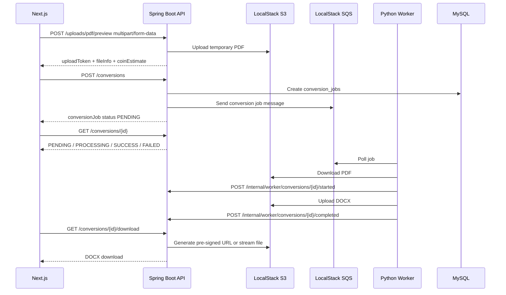

# API Specification - Website Convert PDF to Word

**Phiên bản:** 1.0 MVP  
**Công nghệ:** Next.js + Spring Boot + MySQL Docker + LocalStack S3 + LocalStack SQS + Python Worker  
**Mục tiêu:** Định nghĩa REST API giữa frontend Next.js, backend Spring Boot, MySQL, S3-compatible storage, SQS-compatible queue và Python Worker convert file.

---

## 1. Tổng quan kiến trúc API

### 1.1. Thành phần hệ thống

| Thành phần | Công nghệ | Vai trò |
|---|---|---|
| Frontend | Next.js | Giao diện người dùng, gọi REST API, upload PDF, polling trạng thái convert |
| Backend API | Spring Boot | Xác thực, phân quyền, nghiệp vụ coin/payment/support/admin, tạo job convert, ký upload/download |
| Database | MySQL Docker | Lưu user, conversion job, coin transaction, payment, ticket, setting, audit log |
| Object Storage | LocalStack S3 | Lưu file PDF gốc, file DOCX kết quả, file đính kèm support |
| Queue | LocalStack SQS | Hàng đợi conversion job cho Python Worker |
| Worker | Python Worker | Nhận job từ SQS, tải PDF từ S3, convert sang DOCX, upload kết quả, callback backend |

### 1.2. Luồng convert tổng quát



### 1.3. Base URL

Local development:

```text
Frontend: http://localhost:3000
Backend API: http://localhost:8080/api/v1
LocalStack S3: http://localhost:4566
LocalStack SQS: http://localhost:4566
```

Production đề xuất:

```text
Frontend: https://app.example.com
Backend API: https://api.example.com/api/v1
S3/CloudFront: private bucket + signed URL
SQS: AWS SQS
```

---

## 2. Quy ước chung

### 2.1. Content-Type

| Trường hợp | Content-Type |
|---|---|
| JSON API | `application/json` |
| Upload file | `multipart/form-data` |
| Download file | `application/vnd.openxmlformats-officedocument.wordprocessingml.document` |
| Error response | `application/json` |

### 2.2. Authentication

API dùng JWT Bearer Token.

```http
Authorization: Bearer <access_token>
```

Với khách chưa đăng nhập, frontend gửi guest token nếu có:

```http
X-Guest-Token: <guest_token>
```

Với internal worker callback:

```http
X-Worker-Token: <worker_secret>
```

Với idempotency cho các request quan trọng:

```http
Idempotency-Key: <uuid>
```

Nên áp dụng `Idempotency-Key` cho:

- `POST /conversions`
- `POST /payments`
- `POST /admin/payments/{id}/confirm`
- `POST /admin/users/{id}/coin-adjustments`

### 2.3. Role

| Role | Mô tả |
|---|---|
| `GUEST` | Khách chưa đăng nhập, chỉ dùng một số API public và convert miễn phí nếu được phép |
| `USER` | Người dùng đã đăng ký |
| `SUPPORT` | Hỗ trợ viên |
| `ADMIN` | Quản trị viên |

### 2.4. Standard response

Tất cả JSON API nên dùng format thống nhất:

```json
{
  "success": true,
  "data": {},
  "message": "OK",
  "requestId": "req_01JABC..."
}
```

Với danh sách phân trang:

```json
{
  "success": true,
  "data": {
    "items": [],
    "page": 0,
    "size": 20,
    "totalItems": 120,
    "totalPages": 6,
    "hasNext": true
  },
  "message": "OK",
  "requestId": "req_01JABC..."
}
```

Với lỗi:

```json
{
  "success": false,
  "error": {
    "code": "VALIDATION_ERROR",
    "message": "Dữ liệu không hợp lệ.",
    "details": [
      {
        "field": "email",
        "message": "Email không đúng định dạng."
      }
    ]
  },
  "requestId": "req_01JABC..."
}
```

### 2.5. HTTP status code

| Status | Ý nghĩa |
|---:|---|
| `200` | Thành công |
| `201` | Tạo mới thành công |
| `202` | Đã nhận yêu cầu xử lý bất đồng bộ |
| `204` | Thành công, không có body |
| `400` | Request không hợp lệ |
| `401` | Chưa đăng nhập hoặc token hết hạn |
| `403` | Không đủ quyền |
| `404` | Không tìm thấy tài nguyên |
| `409` | Xung đột dữ liệu, ví dụ email đã tồn tại, request xử lý trùng |
| `413` | File quá lớn |
| `415` | File không đúng định dạng |
| `422` | Không thỏa điều kiện nghiệp vụ, ví dụ không đủ coin |
| `429` | Vượt giới hạn sử dụng |
| `500` | Lỗi hệ thống |
| `503` | Worker/queue/storage tạm thời không sẵn sàng |

### 2.6. Pagination query

```text
?page=0&size=20&sort=createdAt,desc
```

### 2.7. Filter date

Dùng ISO-8601:

```text
?from=2026-06-01T00:00:00Z&to=2026-06-30T23:59:59Z
```

---

## 3. Enum dùng chung

### 3.1. User

```text
UserRole = USER | ADMIN | SUPPORT
UserStatus = ACTIVE | LOCKED | BANNED
```

### 3.2. Conversion

```text
ConversionMode = FREE | PREMIUM
ProcessingType = NORMAL | OCR
ConversionStatus = PENDING | QUEUED | PROCESSING | SUCCESS | FAILED | EXPIRED | DELETED
```

Ghi chú:

- `PENDING`: đã tạo job nhưng chưa đưa vào queue hoặc đang chuẩn bị.
- `QUEUED`: đã gửi job vào SQS.
- `PROCESSING`: worker đang xử lý.
- `SUCCESS`: convert thành công.
- `FAILED`: convert thất bại.
- `EXPIRED`: file kết quả hết hạn.
- `DELETED`: file đã bị xóa khỏi storage.

### 3.3. Coin

```text
CoinTransactionType = ADD | DEDUCT | REFUND | ADJUST
CoinTransactionStatus = PENDING | SUCCESS | FAILED | CANCELED
```

### 3.4. Payment

```text
PaymentMethod = MANUAL | BANK_TRANSFER | MOMO | VNPAY | ZALOPAY
PaymentStatus = PENDING | SUCCESS | FAILED | CANCELED
```

MVP dùng `MANUAL` hoặc `BANK_TRANSFER` giả lập/thủ công. `MOMO`, `VNPAY`, `ZALOPAY` dành cho phiên bản nâng cấp.

### 3.5. Support

```text
TicketIssueType = CONVERT_ERROR | PAYMENT_ERROR | COIN_ERROR | ACCOUNT_ERROR | OTHER
TicketPriority = LOW | NORMAL | HIGH | URGENT
TicketStatus = NEW | IN_PROGRESS | REPLIED | RESOLVED | CANCELED
MessageSenderRole = USER | SUPPORT | ADMIN | BOT | SYSTEM
```

---

## 4. Object schema chính

### 4.1. UserDto

```json
{
  "id": 1,
  "fullName": "Nguyen Van A",
  "email": "user@example.com",
  "role": "USER",
  "coinBalance": 100,
  "status": "ACTIVE",
  "lastLoginAt": "2026-06-22T10:00:00Z",
  "createdAt": "2026-06-01T10:00:00Z",
  "updatedAt": "2026-06-22T10:00:00Z"
}
```

### 4.2. AuthTokenDto

```json
{
  "accessToken": "jwt_access_token",
  "refreshToken": "jwt_refresh_token",
  "tokenType": "Bearer",
  "expiresIn": 3600,
  "user": {}
}
```

### 4.3. UploadPreviewDto

```json
{
  "uploadToken": "signed_upload_token",
  "expiresAt": "2026-06-22T11:00:00Z",
  "file": {
    "originalFileName": "example.pdf",
    "fileSizeBytes": 3355443,
    "totalPages": 12,
    "contentType": "application/pdf"
  },
  "freeEligibility": {
    "eligible": true,
    "remainingFreeUsesToday": 4,
    "reasons": []
  },
  "coinEstimate": {
    "normal": 12,
    "ocr": 24,
    "currency": "coin"
  }
}
```

### 4.4. ConversionJobDto

```json
{
  "id": 1001,
  "requestCode": "CVT-20260622-000001",
  "originalFileName": "example.pdf",
  "outputFileName": "example.docx",
  "fileSizeBytes": 3355443,
  "totalPages": 12,
  "conversionMode": "PREMIUM",
  "processingType": "NORMAL",
  "coinEstimated": 12,
  "coinCharged": 12,
  "status": "SUCCESS",
  "queuePriority": 1,
  "errorMessage": null,
  "startedAt": "2026-06-22T10:01:00Z",
  "completedAt": "2026-06-22T10:02:30Z",
  "fileExpiredAt": "2026-06-23T10:02:30Z",
  "createdAt": "2026-06-22T10:00:30Z",
  "updatedAt": "2026-06-22T10:02:30Z",
  "downloadAvailable": true
}
```

### 4.5. CoinPackageDto

```json
{
  "id": 1,
  "name": "Gói 1",
  "priceVnd": 10000,
  "coinAmount": 100,
  "description": "Gói coin cơ bản",
  "isActive": true,
  "sortOrder": 1,
  "createdAt": "2026-06-01T00:00:00Z",
  "updatedAt": "2026-06-01T00:00:00Z"
}
```

### 4.6. PaymentDto

```json
{
  "id": 5001,
  "paymentCode": "PAY-20260622-000001",
  "coinPackageId": 1,
  "amountVnd": 10000,
  "coinAmount": 100,
  "paymentMethod": "MANUAL",
  "status": "PENDING",
  "paymentContent": "NAPCOIN 5001 USER1",
  "providerTransactionCode": null,
  "note": null,
  "paidAt": null,
  "createdAt": "2026-06-22T10:00:00Z",
  "updatedAt": "2026-06-22T10:00:00Z"
}
```

### 4.7. CoinTransactionDto

```json
{
  "id": 9001,
  "transactionCode": "COIN-20260622-000001",
  "type": "DEDUCT",
  "amount": 12,
  "balanceBefore": 100,
  "balanceAfter": 88,
  "reason": "Convert premium file example.pdf",
  "status": "SUCCESS",
  "paymentId": null,
  "conversionJobId": 1001,
  "createdAt": "2026-06-22T10:02:30Z"
}
```

### 4.8. SupportTicketDto

```json
{
  "id": 7001,
  "ticketCode": "TICKET-20260622-000001",
  "title": "Convert thất bại",
  "content": "File của tôi bị lỗi khi convert.",
  "issueType": "CONVERT_ERROR",
  "priority": "NORMAL",
  "status": "NEW",
  "relatedPaymentId": null,
  "relatedConversionJobId": 1001,
  "assignedSupportId": null,
  "createdAt": "2026-06-22T10:10:00Z",
  "updatedAt": "2026-06-22T10:10:00Z",
  "resolvedAt": null
}
```

### 4.9. SystemSettingDto

```json
{
  "id": 1,
  "settingKey": "free_max_file_size_mb",
  "settingValue": "5",
  "dataType": "INT",
  "description": "Dung lượng file tối đa cho chế độ miễn phí",
  "updatedAt": "2026-06-22T10:00:00Z"
}
```

---

## 5. API xác thực và tài khoản

### 5.1. Đăng ký

```http
POST /api/v1/auth/register
```

Role: Public

Request:

```json
{
  "fullName": "Nguyen Van A",
  "email": "user@example.com",
  "password": "Password@123",
  "confirmPassword": "Password@123"
}
```

Response `201`:

```json
{
  "success": true,
  "data": {
    "id": 1,
    "fullName": "Nguyen Van A",
    "email": "user@example.com",
    "role": "USER",
    "coinBalance": 0,
    "status": "ACTIVE"
  },
  "message": "Đăng ký thành công."
}
```

Validation:

- Email không rỗng.
- Email đúng định dạng.
- Email chưa tồn tại.
- Mật khẩu đủ độ dài.
- `confirmPassword` phải khớp.

### 5.2. Đăng nhập

```http
POST /api/v1/auth/login
```

Role: Public

Request:

```json
{
  "email": "user@example.com",
  "password": "Password@123"
}
```

Response `200`:

```json
{
  "success": true,
  "data": {
    "accessToken": "jwt_access_token",
    "refreshToken": "jwt_refresh_token",
    "tokenType": "Bearer",
    "expiresIn": 3600,
    "user": {
      "id": 1,
      "fullName": "Nguyen Van A",
      "email": "user@example.com",
      "role": "USER",
      "coinBalance": 0,
      "status": "ACTIVE"
    }
  },
  "message": "Đăng nhập thành công."
}
```

Error:

- `401 INVALID_CREDENTIALS`
- `403 ACCOUNT_LOCKED`

### 5.3. Refresh token

```http
POST /api/v1/auth/refresh
```

Role: Authenticated

Request:

```json
{
  "refreshToken": "jwt_refresh_token"
}
```

Response `200`:

```json
{
  "success": true,
  "data": {
    "accessToken": "new_jwt_access_token",
    "refreshToken": "new_jwt_refresh_token",
    "tokenType": "Bearer",
    "expiresIn": 3600
  }
}
```

### 5.4. Đăng xuất

```http
POST /api/v1/auth/logout
```

Role: Authenticated

Request:

```json
{
  "refreshToken": "jwt_refresh_token"
}
```

Response `204`.

### 5.5. Quên mật khẩu

```http
POST /api/v1/auth/forgot-password
```

Role: Public

Request:

```json
{
  "email": "user@example.com"
}
```

Response `200`:

```json
{
  "success": true,
  "data": null,
  "message": "Nếu email tồn tại, hệ thống sẽ gửi hướng dẫn đặt lại mật khẩu."
}
```

Ghi chú: Response không tiết lộ email có tồn tại hay không.

### 5.6. Đặt lại mật khẩu

```http
POST /api/v1/auth/reset-password
```

Role: Public

Request:

```json
{
  "token": "raw_reset_token",
  "newPassword": "NewPassword@123",
  "confirmPassword": "NewPassword@123"
}
```

Response `200`.

### 5.7. Lấy thông tin tài khoản hiện tại

```http
GET /api/v1/users/me
```

Role: USER, SUPPORT, ADMIN

Response `200`: `UserDto`

### 5.8. Cập nhật hồ sơ cá nhân

```http
PATCH /api/v1/users/me
```

Role: USER, SUPPORT, ADMIN

Request:

```json
{
  "fullName": "Nguyen Van B"
}
```

Response `200`: `UserDto`

### 5.9. Đổi mật khẩu

```http
PATCH /api/v1/users/me/password
```

Role: USER, SUPPORT, ADMIN

Request:

```json
{
  "currentPassword": "Password@123",
  "newPassword": "NewPassword@123",
  "confirmPassword": "NewPassword@123"
}
```

Response `204`.

---

## 6. API upload và convert PDF

### 6.1. Upload PDF để preview

```http
POST /api/v1/uploads/pdf/preview
```

Role: Public hoặc USER

Content-Type: `multipart/form-data`

Request form-data:

| Field | Type | Required | Mô tả |
|---|---|---:|---|
| `file` | File | Yes | File PDF |
| `guestToken` | String | No | Guest token nếu chưa đăng nhập |

Response `200`: `UploadPreviewDto`

```json
{
  "success": true,
  "data": {
    "uploadToken": "signed_upload_token",
    "expiresAt": "2026-06-22T11:00:00Z",
    "file": {
      "originalFileName": "example.pdf",
      "fileSizeBytes": 3355443,
      "totalPages": 12,
      "contentType": "application/pdf"
    },
    "freeEligibility": {
      "eligible": true,
      "remainingFreeUsesToday": 4,
      "reasons": []
    },
    "coinEstimate": {
      "normal": 12,
      "ocr": 24,
      "currency": "coin"
    }
  }
}
```

Backend xử lý:

1. Kiểm tra extension `.pdf`.
2. Kiểm tra MIME type.
3. Kiểm tra dung lượng tối đa hệ thống.
4. Đọc số trang PDF.
5. Upload file vào S3 path tạm:

```text
tmp/uploads/{yyyy}/{MM}/{dd}/{uuid}.pdf
```

6. Trả về `uploadToken` đã ký, chứa:
   - S3 bucket.
   - S3 key.
   - original file name.
   - file size.
   - total pages.
   - user id hoặc guest token.
   - expired at.

Error:

| Code | HTTP | Mô tả |
|---|---:|---|
| `INVALID_FILE_TYPE` | 415 | File không phải PDF |
| `FILE_TOO_LARGE` | 413 | File vượt giới hạn |
| `PDF_READ_FAILED` | 422 | Không đọc được PDF |
| `UPLOAD_STORAGE_FAILED` | 503 | Không upload được lên S3 |

### 6.2. Xóa upload tạm

```http
DELETE /api/v1/uploads/pdf/preview
```

Role: Public hoặc USER

Request:

```json
{
  "uploadToken": "signed_upload_token"
}
```

Response `204`.

Ghi chú: API này xóa file tạm khỏi S3 nếu user chọn file khác.

### 6.3. Tạo conversion job

```http
POST /api/v1/conversions
```

Role:

- Public: chỉ cho `conversionMode = FREE`
- USER: cho `FREE` hoặc `PREMIUM`

Headers:

```http
Idempotency-Key: <uuid>
Authorization: Bearer <token>   // optional với FREE
X-Guest-Token: <guest_token>    // optional nếu guest
```

Request:

```json
{
  "uploadToken": "signed_upload_token",
  "conversionMode": "PREMIUM",
  "processingType": "NORMAL",
  "confirmCoin": true
}
```

Response `202`:

```json
{
  "success": true,
  "data": {
    "id": 1001,
    "requestCode": "CVT-20260622-000001",
    "originalFileName": "example.pdf",
    "outputFileName": null,
    "fileSizeBytes": 3355443,
    "totalPages": 12,
    "conversionMode": "PREMIUM",
    "processingType": "NORMAL",
    "coinEstimated": 12,
    "coinCharged": 0,
    "status": "QUEUED",
    "queuePriority": 1,
    "createdAt": "2026-06-22T10:00:30Z",
    "downloadAvailable": false
  },
  "message": "Yêu cầu convert đã được đưa vào hàng đợi."
}
```

Backend xử lý:

1. Xác thực `uploadToken`.
2. Kiểm tra file tạm còn hạn.
3. Kiểm tra quyền:
   - Guest chỉ được FREE.
   - PREMIUM yêu cầu đăng nhập.
4. Tính lại coin phía backend, không tin giá trị từ frontend.
5. Nếu FREE:
   - Check `free_conversion_usages`.
   - Check file `< 5MB`.
   - Check page `< 30`.
   - Check số lần miễn phí trong ngày.
6. Nếu PREMIUM:
   - Check `confirmCoin = true`.
   - Check `users.coin_balance >= coinEstimated`.
   - Không trừ coin ở bước tạo job nếu chính sách là trừ khi thành công.
7. Tạo `conversion_jobs`.
8. Copy/move S3 file từ `tmp/uploads/...` sang:

```text
source/{conversionJobId}/{originalFileName}
```

9. Gửi SQS message.
10. Cập nhật `status = QUEUED`.

Error:

| Code | HTTP | Mô tả |
|---|---:|---|
| `UPLOAD_TOKEN_INVALID` | 400 | Upload token sai |
| `UPLOAD_TOKEN_EXPIRED` | 400 | Upload token hết hạn |
| `AUTH_REQUIRED_FOR_PREMIUM` | 401 | Premium cần đăng nhập |
| `FREE_LIMIT_EXCEEDED` | 429 | Hết lượt miễn phí |
| `FREE_FILE_TOO_LARGE` | 422 | File vượt giới hạn miễn phí |
| `FREE_PAGE_TOO_MANY` | 422 | Số trang vượt giới hạn miễn phí |
| `INSUFFICIENT_COIN` | 422 | Không đủ coin |
| `QUEUE_UNAVAILABLE` | 503 | Không gửi được SQS message |

### 6.4. Lấy chi tiết conversion job

```http
GET /api/v1/conversions/{id}
```

Role:

- Owner USER
- Guest có token hợp lệ
- SUPPORT/ADMIN có quyền xem

Response `200`: `ConversionJobDto`

### 6.5. Danh sách lịch sử convert của user

```http
GET /api/v1/conversions
```

Role: USER

Query:

| Query | Type | Required | Mô tả |
|---|---|---:|---|
| `status` | ConversionStatus | No | Lọc theo trạng thái |
| `conversionMode` | ConversionMode | No | FREE/PREMIUM |
| `processingType` | ProcessingType | No | NORMAL/OCR |
| `from` | DateTime | No | Từ ngày |
| `to` | DateTime | No | Đến ngày |
| `page` | Integer | No | Mặc định 0 |
| `size` | Integer | No | Mặc định 20 |

Response `200`: paginated `ConversionJobDto`.

### 6.6. Lấy trạng thái convert ngắn gọn cho polling

```http
GET /api/v1/conversions/{id}/status
```

Role: Owner USER, Guest token, SUPPORT, ADMIN

Response `200`:

```json
{
  "success": true,
  "data": {
    "id": 1001,
    "status": "PROCESSING",
    "progress": 45,
    "message": "Đang chuyển đổi file.",
    "downloadAvailable": false,
    "errorMessage": null,
    "updatedAt": "2026-06-22T10:01:10Z"
  }
}
```

Ghi chú:

- MVP có thể không có progress thật, trả `null` hoặc ước lượng theo status.
- Frontend polling mỗi 3-5 giây.
- Dừng polling khi `SUCCESS`, `FAILED`, `EXPIRED`, `DELETED`.

### 6.7. Tải file DOCX

```http
GET /api/v1/conversions/{id}/download
```

Role: Owner USER, Guest token hợp lệ, ADMIN/SUPPORT nếu được phân quyền

Response:

- `200` stream file DOCX, hoặc
- `302` redirect đến pre-signed URL S3.

Headers đề xuất:

```http
Content-Disposition: attachment; filename="example.docx"
Content-Type: application/vnd.openxmlformats-officedocument.wordprocessingml.document
```

Error:

| Code | HTTP | Mô tả |
|---|---:|---|
| `CONVERSION_NOT_SUCCESS` | 422 | Chưa convert thành công |
| `FILE_EXPIRED` | 410 | File đã hết hạn |
| `FILE_DELETED` | 410 | File đã bị xóa |
| `ACCESS_DENIED` | 403 | Không có quyền tải |

### 6.8. Lấy download URL

```http
GET /api/v1/conversions/{id}/download-url
```

Role: Owner USER, Guest token hợp lệ

Response `200`:

```json
{
  "success": true,
  "data": {
    "url": "http://localhost:4566/pdf-converter/output/1001/example.docx?...signature...",
    "expiresIn": 300
  }
}
```

Ghi chú: Dùng khi frontend muốn tải trực tiếp từ S3-compatible endpoint.

### 6.9. Retry conversion

```http
POST /api/v1/conversions/{id}/retry
```

Role: Owner USER hoặc ADMIN

Chỉ cho phép retry khi:

- Job thuộc user hiện tại.
- Job `FAILED`.
- File gốc còn tồn tại.
- Chưa quá giới hạn retry.

Request:

```json
{
  "processingType": "NORMAL"
}
```

Response `202`: `ConversionJobDto`.

### 6.10. Kiểm tra lượt miễn phí hôm nay

```http
GET /api/v1/conversions/free-usage/today
```

Role: Public hoặc USER

Headers optional:

```http
X-Guest-Token: <guest_token>
```

Response:

```json
{
  "success": true,
  "data": {
    "identityType": "USER",
    "usedCount": 1,
    "dailyLimit": 5,
    "remaining": 4,
    "usageDate": "2026-06-22"
  }
}
```

---

## 7. API ví coin và giao dịch coin

### 7.1. Xem ví coin

```http
GET /api/v1/wallet
```

Role: USER

Response `200`:

```json
{
  "success": true,
  "data": {
    "userId": 1,
    "coinBalance": 100,
    "totalAdded": 500,
    "totalDeducted": 380,
    "totalRefunded": 20
  }
}
```

### 7.2. Lịch sử giao dịch coin

```http
GET /api/v1/coin-transactions
```

Role: USER

Query:

| Query | Type | Mô tả |
|---|---|---|
| `type` | ADD/DEDUCT/REFUND/ADJUST | Lọc loại giao dịch |
| `status` | SUCCESS/... | Lọc trạng thái |
| `from` | DateTime | Từ ngày |
| `to` | DateTime | Đến ngày |
| `page` | Integer | Trang |
| `size` | Integer | Kích thước trang |

Response `200`: paginated `CoinTransactionDto`.

### 7.3. Chi tiết giao dịch coin

```http
GET /api/v1/coin-transactions/{id}
```

Role: Owner USER hoặc ADMIN

Response `200`: `CoinTransactionDto`.

---

## 8. API gói coin và thanh toán

### 8.1. Danh sách gói coin public

```http
GET /api/v1/coin-packages
```

Role: Public

Query:

```text
?activeOnly=true
```

Response `200`:

```json
{
  "success": true,
  "data": [
    {
      "id": 1,
      "name": "Gói 1",
      "priceVnd": 10000,
      "coinAmount": 100,
      "description": "Gói coin cơ bản",
      "isActive": true,
      "sortOrder": 1
    }
  ]
}
```

### 8.2. Tạo thanh toán nạp coin

```http
POST /api/v1/payments
```

Role: USER

Headers:

```http
Idempotency-Key: <uuid>
```

Request:

```json
{
  "coinPackageId": 1,
  "paymentMethod": "MANUAL"
}
```

Response `201`:

```json
{
  "success": true,
  "data": {
    "id": 5001,
    "paymentCode": "PAY-20260622-000001",
    "coinPackageId": 1,
    "amountVnd": 10000,
    "coinAmount": 100,
    "paymentMethod": "MANUAL",
    "status": "PENDING",
    "paymentContent": "NAPCOIN PAY-20260622-000001 USER1",
    "paidAt": null,
    "createdAt": "2026-06-22T10:00:00Z"
  },
  "message": "Đã tạo giao dịch nạp coin."
}
```

MVP:

- Tạo payment `PENDING`.
- Admin xác nhận thủ công.
- Chưa tích hợp callback MoMo/VNPAY thật.

### 8.3. Danh sách payment của user

```http
GET /api/v1/payments
```

Role: USER

Query:

| Query | Type | Mô tả |
|---|---|---|
| `status` | PaymentStatus | Lọc trạng thái |
| `from` | DateTime | Từ ngày |
| `to` | DateTime | Đến ngày |
| `page` | Integer | Trang |
| `size` | Integer | Kích thước trang |

Response `200`: paginated `PaymentDto`.

### 8.4. Chi tiết payment

```http
GET /api/v1/payments/{id}
```

Role: Owner USER hoặc ADMIN

Response `200`: `PaymentDto`.

### 8.5. Hủy payment pending

```http
POST /api/v1/payments/{id}/cancel
```

Role: Owner USER

Chỉ được hủy khi `status = PENDING`.

Response `200`: `PaymentDto` với `status = CANCELED`.

---

## 9. API hỗ trợ và khiếu nại

### 9.1. Tạo ticket hỗ trợ

```http
POST /api/v1/tickets
```

Role: USER

Request:

```json
{
  "title": "Convert thất bại",
  "content": "File của tôi bị lỗi khi convert.",
  "issueType": "CONVERT_ERROR",
  "relatedConversionJobId": 1001,
  "relatedPaymentId": null
}
```

Response `201`: `SupportTicketDto`

Backend mặc định:

- `priority = NORMAL`
- `status = NEW`
- Tạo `support_messages` đầu tiên từ `content`.

### 9.2. Danh sách ticket của user

```http
GET /api/v1/tickets
```

Role: USER

Query:

| Query | Type | Mô tả |
|---|---|---|
| `status` | TicketStatus | Lọc trạng thái |
| `issueType` | TicketIssueType | Lọc loại |
| `page` | Integer | Trang |
| `size` | Integer | Kích thước trang |

Response `200`: paginated `SupportTicketDto`.

### 9.3. Chi tiết ticket

```http
GET /api/v1/tickets/{id}
```

Role: Owner USER, SUPPORT assigned, ADMIN

Response `200`: `SupportTicketDto`.

### 9.4. Lấy tin nhắn trong ticket

```http
GET /api/v1/tickets/{id}/messages
```

Role: Owner USER, SUPPORT, ADMIN

Response `200`:

```json
{
  "success": true,
  "data": [
    {
      "id": 1,
      "ticketId": 7001,
      "senderId": 1,
      "senderRole": "USER",
      "message": "File của tôi bị lỗi khi convert.",
      "attachmentUrl": null,
      "isRead": true,
      "createdAt": "2026-06-22T10:10:00Z"
    }
  ]
}
```

### 9.5. Gửi tin nhắn ticket

```http
POST /api/v1/tickets/{id}/messages
```

Role: Owner USER, SUPPORT, ADMIN

Content-Type: `multipart/form-data` hoặc `application/json`

JSON request:

```json
{
  "message": "Bạn vui lòng kiểm tra giúp tôi."
}
```

Multipart form-data:

| Field | Type | Required | Mô tả |
|---|---|---:|---|
| `message` | String | Yes | Nội dung |
| `attachment` | File | No | File đính kèm |

Response `201`.

Nếu ticket đang `RESOLVED` hoặc `CANCELED`, không cho gửi trừ khi reopen.

### 9.6. Đánh dấu ticket đã giải quyết

```http
POST /api/v1/tickets/{id}/resolve
```

Role: Owner USER, SUPPORT, ADMIN

Response `200`: `SupportTicketDto` với `status = RESOLVED`.

### 9.7. Hủy ticket

```http
POST /api/v1/tickets/{id}/cancel
```

Role: Owner USER hoặc ADMIN

Response `200`: `SupportTicketDto` với `status = CANCELED`.

---

## 10. API chatbot AI

MVP có thể dùng chatbot rule-based hoặc mock response. Phiên bản nâng cấp có thể tích hợp AI thật.

### 10.1. Tạo phiên chatbot

```http
POST /api/v1/chatbot/conversations
```

Role: Public hoặc USER

Request:

```json
{
  "guestToken": "guest_abc"
}
```

Response `201`:

```json
{
  "success": true,
  "data": {
    "id": 3001,
    "status": "OPEN",
    "createdAt": "2026-06-22T10:00:00Z"
  }
}
```

### 10.2. Gửi tin nhắn chatbot

```http
POST /api/v1/chatbot/conversations/{id}/messages
```

Role: Public hoặc USER

Request:

```json
{
  "message": "File miễn phí được lưu bao lâu?"
}
```

Response `201`:

```json
{
  "success": true,
  "data": {
    "userMessage": {
      "id": 10,
      "senderRole": "USER",
      "message": "File miễn phí được lưu bao lâu?",
      "createdAt": "2026-06-22T10:00:00Z"
    },
    "botMessage": {
      "id": 11,
      "senderRole": "BOT",
      "message": "File convert miễn phí được lưu trong 1 giờ. File convert nâng cao được lưu trong 24 giờ.",
      "createdAt": "2026-06-22T10:00:01Z"
    }
  }
}
```

### 10.3. Lấy lịch sử chatbot

```http
GET /api/v1/chatbot/conversations/{id}/messages
```

Role: Owner USER hoặc guest token

Response `200`.

### 10.4. Đánh giá câu trả lời chatbot

```http
POST /api/v1/chatbot/messages/{id}/rating
```

Role: Public hoặc USER

Request:

```json
{
  "rating": 5
}
```

Response `204`.

### 10.5. Chuyển chatbot sang ticket

```http
POST /api/v1/chatbot/conversations/{id}/escalate
```

Role: USER

Request:

```json
{
  "title": "Cần hỗ trợ thêm",
  "issueType": "OTHER",
  "content": "Chatbot chưa giải quyết được vấn đề của tôi."
}
```

Response `201`: `SupportTicketDto`.

---

## 11. API admin

Tất cả API admin yêu cầu role `ADMIN`.

### 11.1. Dashboard summary

```http
GET /api/v1/admin/dashboard/summary
```

Response `200`:

```json
{
  "success": true,
  "data": {
    "totalUsers": 120,
    "totalConversions": 500,
    "freeConversions": 350,
    "premiumConversions": 150,
    "totalCoinAdded": 10000,
    "totalCoinUsed": 6400,
    "revenueVnd": 2500000,
    "pendingPayments": 5,
    "failedConversions": 12,
    "openTickets": 8
  }
}
```

### 11.2. Danh sách user

```http
GET /api/v1/admin/users
```

Query:

| Query | Type | Mô tả |
|---|---|---|
| `keyword` | String | Tìm theo email/họ tên |
| `role` | USER/ADMIN/SUPPORT | Lọc role |
| `status` | ACTIVE/LOCKED/BANNED | Lọc trạng thái |
| `page` | Integer | Trang |
| `size` | Integer | Kích thước trang |

Response `200`: paginated `UserDto`.

### 11.3. Chi tiết user

```http
GET /api/v1/admin/users/{id}
```

Response `200`: `UserDto`.

### 11.4. Cập nhật trạng thái user

```http
PATCH /api/v1/admin/users/{id}/status
```

Request:

```json
{
  "status": "LOCKED",
  "reason": "Vi phạm điều khoản sử dụng."
}
```

Response `200`: `UserDto`.

### 11.5. Cập nhật role user

```http
PATCH /api/v1/admin/users/{id}/role
```

Request:

```json
{
  "role": "SUPPORT"
}
```

Response `200`: `UserDto`.

### 11.6. Điều chỉnh coin thủ công

```http
POST /api/v1/admin/users/{id}/coin-adjustments
```

Headers:

```http
Idempotency-Key: <uuid>
```

Request:

```json
{
  "type": "ADJUST",
  "amount": 50,
  "operation": "ADD",
  "reason": "Bồi hoàn theo khiếu nại TICKET-20260622-000001"
}
```

Response `201`: `CoinTransactionDto`.

Backend bắt buộc:

- Lock row user bằng transaction.
- Không cho coin âm.
- Tạo `coin_transactions`.
- Ghi `admin_audit_logs`.

### 11.7. Admin quản lý gói coin

#### Danh sách

```http
GET /api/v1/admin/coin-packages
```

Response `200`: paginated `CoinPackageDto`.

#### Tạo gói

```http
POST /api/v1/admin/coin-packages
```

Request:

```json
{
  "name": "Gói 4",
  "priceVnd": 200000,
  "coinAmount": 3500,
  "description": "Gói nhiều coin",
  "isActive": true,
  "sortOrder": 4
}
```

Response `201`: `CoinPackageDto`.

#### Cập nhật gói

```http
PATCH /api/v1/admin/coin-packages/{id}
```

Request:

```json
{
  "priceVnd": 200000,
  "coinAmount": 3500,
  "isActive": true
}
```

Response `200`: `CoinPackageDto`.

#### Xóa mềm hoặc tắt gói

```http
DELETE /api/v1/admin/coin-packages/{id}
```

Response `204`.

Ghi chú: MVP nên tắt `isActive = false`, không xóa cứng nếu đã có payment liên quan.

### 11.8. Admin quản lý payment

#### Danh sách payment

```http
GET /api/v1/admin/payments
```

Query:

| Query | Type | Mô tả |
|---|---|---|
| `userId` | Long | Lọc user |
| `status` | PaymentStatus | Lọc trạng thái |
| `paymentMethod` | PaymentMethod | Lọc phương thức |
| `from` | DateTime | Từ ngày |
| `to` | DateTime | Đến ngày |
| `page` | Integer | Trang |
| `size` | Integer | Kích thước |

Response `200`: paginated `PaymentDto`.

#### Chi tiết payment

```http
GET /api/v1/admin/payments/{id}
```

Response `200`: `PaymentDto`.

#### Xác nhận thanh toán thủ công

```http
POST /api/v1/admin/payments/{id}/confirm
```

Headers:

```http
Idempotency-Key: <uuid>
```

Request:

```json
{
  "providerTransactionCode": "BANK-REF-123456",
  "note": "Đã nhận chuyển khoản."
}
```

Response `200`: `PaymentDto` với `status = SUCCESS`.

Backend xử lý trong transaction:

1. Lock payment.
2. Nếu payment đã `SUCCESS`, trả về trạng thái hiện tại, không cộng coin lần 2.
3. Cập nhật payment `SUCCESS`, `paidAt`.
4. Lock user.
5. Cộng coin vào `users.coin_balance`.
6. Tạo `coin_transactions` loại `ADD`.
7. Ghi `admin_audit_logs`.

#### Đánh dấu payment thất bại

```http
POST /api/v1/admin/payments/{id}/fail
```

Request:

```json
{
  "note": "Không nhận được thanh toán."
}
```

Response `200`.

#### Hủy payment

```http
POST /api/v1/admin/payments/{id}/cancel
```

Request:

```json
{
  "note": "Người dùng yêu cầu hủy."
}
```

Response `200`.

### 11.9. Admin quản lý conversion

#### Danh sách conversion jobs

```http
GET /api/v1/admin/conversions
```

Query:

| Query | Type | Mô tả |
|---|---|---|
| `userId` | Long | Lọc user |
| `status` | ConversionStatus | Lọc trạng thái |
| `conversionMode` | ConversionMode | Lọc FREE/PREMIUM |
| `processingType` | ProcessingType | Lọc NORMAL/OCR |
| `from` | DateTime | Từ ngày |
| `to` | DateTime | Đến ngày |
| `page` | Integer | Trang |
| `size` | Integer | Kích thước |

Response `200`: paginated `ConversionJobDto`.

#### Chi tiết conversion

```http
GET /api/v1/admin/conversions/{id}
```

Response `200`: `ConversionJobDto`.

#### Đánh dấu xóa file

```http
POST /api/v1/admin/conversions/{id}/delete-files
```

Request:

```json
{
  "deleteOriginal": true,
  "deleteOutput": true,
  "reason": "File hết hạn hoặc theo yêu cầu người dùng."
}
```

Response `200`: `ConversionJobDto`.

### 11.10. Admin xem coin transactions

```http
GET /api/v1/admin/coin-transactions
```

Query:

| Query | Type | Mô tả |
|---|---|---|
| `userId` | Long | Lọc user |
| `type` | CoinTransactionType | Lọc loại |
| `status` | CoinTransactionStatus | Lọc trạng thái |
| `paymentId` | Long | Lọc theo payment |
| `conversionJobId` | Long | Lọc theo conversion |
| `from` | DateTime | Từ ngày |
| `to` | DateTime | Đến ngày |

Response `200`: paginated `CoinTransactionDto`.

### 11.11. Admin quản lý ticket

```http
GET /api/v1/admin/tickets
```

Query:

| Query | Type | Mô tả |
|---|---|---|
| `status` | TicketStatus | Lọc trạng thái |
| `issueType` | TicketIssueType | Lọc loại |
| `priority` | TicketPriority | Lọc ưu tiên |
| `assignedSupportId` | Long | Lọc hỗ trợ viên |
| `userId` | Long | Lọc user |

Response `200`: paginated `SupportTicketDto`.

#### Gán ticket cho support

```http
PATCH /api/v1/admin/tickets/{id}/assignment
```

Request:

```json
{
  "assignedSupportId": 10
}
```

Response `200`: `SupportTicketDto`.

#### Cập nhật priority/status

```http
PATCH /api/v1/admin/tickets/{id}
```

Request:

```json
{
  "priority": "HIGH",
  "status": "IN_PROGRESS"
}
```

Response `200`.

### 11.12. Admin cấu hình hệ thống

#### Lấy settings

```http
GET /api/v1/admin/settings
```

Response `200`:

```json
{
  "success": true,
  "data": [
    {
      "settingKey": "free_max_file_size_mb",
      "settingValue": "5",
      "dataType": "INT"
    }
  ]
}
```

#### Cập nhật một setting

```http
PATCH /api/v1/admin/settings/{settingKey}
```

Request:

```json
{
  "settingValue": "10"
}
```

Response `200`: `SystemSettingDto`.

#### Cập nhật nhiều settings

```http
PUT /api/v1/admin/settings
```

Request:

```json
{
  "settings": [
    {
      "settingKey": "free_max_file_size_mb",
      "settingValue": "5"
    },
    {
      "settingKey": "free_daily_limit",
      "settingValue": "5"
    }
  ]
}
```

Response `200`.

### 11.13. Admin audit logs

```http
GET /api/v1/admin/audit-logs
```

Query:

| Query | Type | Mô tả |
|---|---|---|
| `actorId` | Long | Người thao tác |
| `action` | String | Hành động |
| `targetTable` | String | Bảng |
| `from` | DateTime | Từ ngày |
| `to` | DateTime | Đến ngày |

Response `200`.

---

## 12. API support dashboard

Các API này dành cho `SUPPORT` và `ADMIN`.

### 12.1. Support dashboard summary

```http
GET /api/v1/support/dashboard/summary
```

Role: SUPPORT, ADMIN

Response:

```json
{
  "success": true,
  "data": {
    "newTickets": 10,
    "inProgressTickets": 5,
    "repliedTickets": 3,
    "urgentTickets": 2
  }
}
```

### 12.2. Danh sách ticket cho support

```http
GET /api/v1/support/tickets
```

Role: SUPPORT, ADMIN

Query:

| Query | Type | Mô tả |
|---|---|---|
| `status` | TicketStatus | Lọc trạng thái |
| `issueType` | TicketIssueType | Lọc loại |
| `priority` | TicketPriority | Lọc ưu tiên |
| `assignedToMe` | Boolean | Chỉ ticket được gán cho support hiện tại |

Response `200`: paginated `SupportTicketDto`.

### 12.3. Nhận xử lý ticket

```http
POST /api/v1/support/tickets/{id}/claim
```

Role: SUPPORT, ADMIN

Response `200`: `SupportTicketDto`.

### 12.4. Cập nhật trạng thái ticket

```http
PATCH /api/v1/support/tickets/{id}/status
```

Role: SUPPORT, ADMIN

Request:

```json
{
  "status": "IN_PROGRESS"
}
```

Response `200`.

### 12.5. Chuyển ticket cho admin

```http
POST /api/v1/support/tickets/{id}/escalate-to-admin
```

Role: SUPPORT

Request:

```json
{
  "reason": "Vấn đề cần admin điều chỉnh coin."
}
```

Response `200`.

---

## 13. Internal Worker API

Các endpoint này không được public. Chỉ Python Worker gọi được bằng `X-Worker-Token`.

### 13.1. Worker báo bắt đầu xử lý

```http
POST /api/v1/internal/worker/conversions/{id}/started
```

Headers:

```http
X-Worker-Token: <worker_secret>
```

Request:

```json
{
  "workerId": "worker-01",
  "startedAt": "2026-06-22T10:01:00Z"
}
```

Response `204`.

Backend cập nhật:

- `status = PROCESSING`
- `started_at = startedAt`

### 13.2. Worker báo tiến độ

```http
POST /api/v1/internal/worker/conversions/{id}/progress
```

Request:

```json
{
  "workerId": "worker-01",
  "progress": 45,
  "message": "Đang xử lý trang 5/12"
}
```

Response `204`.

Ghi chú: MVP có thể bỏ qua endpoint này nếu chưa lưu progress.

### 13.3. Worker báo convert thành công

```http
POST /api/v1/internal/worker/conversions/{id}/completed
```

Request:

```json
{
  "workerId": "worker-01",
  "outputFileName": "example.docx",
  "outputFilePath": "output/1001/example.docx",
  "outputFileSizeBytes": 125000,
  "completedAt": "2026-06-22T10:02:30Z"
}
```

Response `204`.

Backend xử lý trong transaction:

1. Lock `conversion_jobs`.
2. Nếu job đã `SUCCESS`, bỏ qua để tránh xử lý trùng.
3. Cập nhật output file.
4. Nếu `conversionMode = PREMIUM`:
   - Lock user.
   - Trừ coin nếu chưa trừ.
   - Tạo `coin_transactions` loại `DEDUCT`.
   - Cập nhật `coin_charged`.
5. Cập nhật `status = SUCCESS`.
6. Set `file_expired_at`:
   - FREE: `completedAt + free_file_storage_hours`
   - PREMIUM: `completedAt + premium_file_storage_hours`

### 13.4. Worker báo convert thất bại

```http
POST /api/v1/internal/worker/conversions/{id}/failed
```

Request:

```json
{
  "workerId": "worker-01",
  "errorCode": "CONVERSION_FAILED",
  "errorMessage": "LibreOffice failed to convert file.",
  "failedAt": "2026-06-22T10:02:30Z",
  "retryable": true
}
```

Response `204`.

Backend xử lý:

1. Cập nhật `status = FAILED`.
2. Lưu `error_message`.
3. Nếu đã trừ coin, tạo `coin_transactions` loại `REFUND`.
4. Không trừ coin nếu chính sách trừ coin sau khi thành công.

### 13.5. Worker heartbeat

```http
POST /api/v1/internal/worker/heartbeat
```

Request:

```json
{
  "workerId": "worker-01",
  "status": "IDLE",
  "currentJobId": null,
  "timestamp": "2026-06-22T10:00:00Z"
}
```

Response `204`.

Ghi chú: MVP có thể chưa cần lưu heartbeat.

---

## 14. SQS message specification

### 14.1. Queue

LocalStack:

```text
Queue name: pdf-conversion-jobs
Queue URL: http://localhost:4566/000000000000/pdf-conversion-jobs
```

Production:

```text
Queue name: pdf-conversion-jobs
```

### 14.2. Message body

```json
{
  "eventType": "CONVERSION_JOB_CREATED",
  "eventVersion": "1.0",
  "jobId": 1001,
  "requestCode": "CVT-20260622-000001",
  "userId": 1,
  "guestToken": null,
  "source": {
    "bucket": "pdf-converter",
    "key": "source/1001/example.pdf",
    "originalFileName": "example.pdf",
    "fileSizeBytes": 3355443,
    "totalPages": 12
  },
  "target": {
    "bucket": "pdf-converter",
    "key": "output/1001/example.docx",
    "outputFileName": "example.docx"
  },
  "conversion": {
    "mode": "PREMIUM",
    "processingType": "NORMAL",
    "coinEstimated": 12,
    "priority": 1
  },
  "callback": {
    "baseUrl": "http://backend:8080/api/v1/internal/worker",
    "startedPath": "/conversions/1001/started",
    "completedPath": "/conversions/1001/completed",
    "failedPath": "/conversions/1001/failed"
  },
  "createdAt": "2026-06-22T10:00:30Z"
}
```

### 14.3. Message attributes

| Attribute | Type | Ví dụ |
|---|---|---|
| `jobId` | Number | `1001` |
| `conversionMode` | String | `PREMIUM` |
| `processingType` | String | `NORMAL` |
| `priority` | Number | `1` |

### 14.4. Retry và dead-letter queue

Đề xuất:

```text
Main queue: pdf-conversion-jobs
DLQ: pdf-conversion-jobs-dlq
maxReceiveCount: 3
visibilityTimeout: 300 seconds
```

Worker phải idempotent:

- Nếu nhận lại message của job đã `SUCCESS`, bỏ qua.
- Nếu job đã `FAILED` và không retryable, bỏ qua.
- Callback backend phải chống xử lý trùng.

---

## 15. S3 object key convention

### 15.1. Bucket

Local:

```text
pdf-converter
```

### 15.2. Object keys

| Loại file | Key pattern |
|---|---|
| Upload tạm | `tmp/uploads/{yyyy}/{MM}/{dd}/{uuid}.pdf` |
| PDF gốc | `source/{conversionJobId}/{safeOriginalFileName}` |
| DOCX kết quả | `output/{conversionJobId}/{safeBaseName}.docx` |
| Ticket attachment | `support/{ticketId}/{uuid}-{safeFileName}` |

### 15.3. Metadata

PDF object metadata:

```json
{
  "originalFileName": "example.pdf",
  "uploadedBy": "user:1",
  "totalPages": "12",
  "contentType": "application/pdf"
}
```

DOCX object metadata:

```json
{
  "conversionJobId": "1001",
  "requestCode": "CVT-20260622-000001",
  "generatedBy": "worker-01"
}
```

### 15.4. Security

- Không public bucket.
- Không trả S3 key thô cho frontend nếu không cần.
- Download dùng backend stream hoặc pre-signed URL ngắn hạn.
- File hết hạn phải bị vô hiệu hóa ở backend trước, sau đó mới xóa vật lý bằng scheduled cleanup.

---

## 16. Quy tắc nghiệp vụ quan trọng

### 16.1. Convert miễn phí

Điều kiện:

- File `.pdf`.
- Dung lượng nhỏ hơn `free_max_file_size_mb`, mặc định 5MB.
- Số trang nhỏ hơn `free_max_pages`, mặc định 30.
- Không vượt quá `free_daily_limit`, mặc định 5 lần/ngày.
- Không tốn coin.
- File kết quả lưu `free_file_storage_hours`, mặc định 1 giờ.

### 16.2. Convert nâng cao

Điều kiện:

- Bắt buộc đăng nhập.
- Người dùng xác nhận coin.
- Số dư coin đủ.
- Tính coin phía backend.
- Queue ưu tiên cao hơn FREE.
- File kết quả lưu `premium_file_storage_hours`, mặc định 24 giờ.

### 16.3. Công thức tính coin

Đề xuất:

```text
Nếu processingType = NORMAL:
    pages <= 30: totalPages * coin_normal_per_page
    pages > 30: 30 * coin_normal_per_page + (totalPages - 30) * coin_after_30_pages_per_page

Nếu processingType = OCR:
    pages <= 30: totalPages * coin_ocr_per_page
    pages > 30: 30 * coin_ocr_per_page + (totalPages - 30) * coin_after_30_pages_per_page
```

Mặc định:

```text
coin_normal_per_page = 1
coin_ocr_per_page = 2
coin_after_30_pages_per_page = 3
```

### 16.4. Thời điểm trừ coin

MVP đề xuất: **trừ coin khi convert thành công**.

Ưu điểm:

- Không cần hoàn coin nếu worker lỗi trước khi xử lý.
- Người dùng không bị trừ coin khi hệ thống thất bại.

Backend vẫn phải check đủ coin trước khi đưa job vào queue.

Rủi ro:

- User có thể dùng coin cho việc khác trong lúc job đang xử lý.
- Cách xử lý đơn giản: khi worker báo success, nếu không đủ coin thì job chuyển `FAILED` với lỗi `INSUFFICIENT_COIN_AT_COMPLETION`.

Cách chặt chẽ hơn cho phiên bản sau:

- Reserve coin khi tạo job.
- Trừ chính thức khi success.
- Release reserve khi failed.

### 16.5. Không xử lý trùng

Các nghiệp vụ sau phải idempotent:

- Tạo conversion job.
- Worker callback success/fail.
- Admin confirm payment.
- Trừ/cộng/hoàn coin.

Nên dùng:

- `request_code` unique.
- `transaction_code` unique.
- `payment_code` unique.
- `Idempotency-Key`.

---

## 17. Error code catalog

| Code | HTTP | Mô tả |
|---|---:|---|
| `VALIDATION_ERROR` | 400 | Dữ liệu không hợp lệ |
| `UNAUTHORIZED` | 401 | Chưa xác thực |
| `FORBIDDEN` | 403 | Không đủ quyền |
| `RESOURCE_NOT_FOUND` | 404 | Không tìm thấy |
| `EMAIL_ALREADY_EXISTS` | 409 | Email đã tồn tại |
| `INVALID_CREDENTIALS` | 401 | Sai email hoặc mật khẩu |
| `ACCOUNT_LOCKED` | 403 | Tài khoản bị khóa |
| `INVALID_FILE_TYPE` | 415 | File không phải PDF |
| `FILE_TOO_LARGE` | 413 | File quá lớn |
| `PDF_READ_FAILED` | 422 | Không đọc được PDF |
| `UPLOAD_TOKEN_INVALID` | 400 | Upload token không hợp lệ |
| `UPLOAD_TOKEN_EXPIRED` | 400 | Upload token hết hạn |
| `FREE_LIMIT_EXCEEDED` | 429 | Vượt lượt miễn phí |
| `FREE_FILE_TOO_LARGE` | 422 | File vượt giới hạn miễn phí |
| `FREE_PAGE_TOO_MANY` | 422 | Số trang vượt giới hạn miễn phí |
| `AUTH_REQUIRED_FOR_PREMIUM` | 401 | Premium yêu cầu đăng nhập |
| `INSUFFICIENT_COIN` | 422 | Không đủ coin |
| `CONVERSION_NOT_SUCCESS` | 422 | Job chưa convert thành công |
| `CONVERSION_FAILED` | 422 | Convert thất bại |
| `FILE_EXPIRED` | 410 | File đã hết hạn |
| `FILE_DELETED` | 410 | File đã bị xóa |
| `PAYMENT_ALREADY_CONFIRMED` | 409 | Payment đã xác nhận |
| `PAYMENT_NOT_PENDING` | 422 | Payment không còn pending |
| `QUEUE_UNAVAILABLE` | 503 | Queue không sẵn sàng |
| `STORAGE_UNAVAILABLE` | 503 | S3 không sẵn sàng |
| `INTERNAL_ERROR` | 500 | Lỗi hệ thống |

---

## 18. Security requirement

### 18.1. Password

- Lưu `password_hash`, không lưu plain text.
- Dùng BCrypt hoặc Argon2.
- Reset password token phải hash trước khi lưu DB.
- Reset token có hạn ngắn, ví dụ 15-30 phút.

### 18.2. JWT

- Access token ngắn hạn, ví dụ 1 giờ.
- Refresh token dài hơn, ví dụ 7-30 ngày.
- Có thể lưu refresh token hash trong DB nếu cần revoke.
- Role nằm trong claim nhưng backend vẫn nên kiểm tra user status trong DB với request quan trọng.

### 18.3. File

- Validate extension và MIME type.
- Kiểm tra PDF có đọc được hay không.
- Không cho download file không thuộc user.
- Không public S3 object.
- Pre-signed URL ngắn hạn.
- Tự động xóa file hết hạn.

### 18.4. Coin/payment

- Dùng database transaction khi cộng/trừ coin.
- Không cho số dư coin âm.
- Không cộng coin hai lần cho một payment.
- Không trừ coin hai lần cho một conversion job.
- Ghi audit log cho thao tác admin.

### 18.5. Internal worker

- Endpoint `/internal/worker/**` không public.
- Bắt buộc `X-Worker-Token`.
- Có thể giới hạn IP/container network.
- Callback phải idempotent.

---

## 19. Health check và monitoring

### 19.1. Spring Boot health

```http
GET /api/v1/health
```

Response:

```json
{
  "success": true,
  "data": {
    "status": "UP",
    "database": "UP",
    "s3": "UP",
    "sqs": "UP"
  }
}
```

Có thể dùng thêm Spring Actuator:

```http
GET /actuator/health
```

### 19.2. Worker health

```http
GET /api/v1/internal/worker-health
```

Hoặc worker gửi heartbeat qua endpoint internal.

---

## 20. Route mapping với Next.js

| Next.js route | API chính |
|---|---|
| `/` | `GET /coin-packages`, chatbot APIs |
| `/upload` | `POST /uploads/pdf/preview`, `POST /conversions` |
| `/conversions` | `GET /conversions` |
| `/conversions/[id]` | `GET /conversions/{id}`, `GET /conversions/{id}/status` |
| `/conversions/[id]/download` | `GET /conversions/{id}/download` |
| `/wallet` | `GET /wallet` |
| `/wallet/transactions` | `GET /coin-transactions` |
| `/payments` | `GET /payments`, `POST /payments` |
| `/payments/[id]` | `GET /payments/{id}` |
| `/tickets` | `GET /tickets`, `POST /tickets` |
| `/tickets/[id]` | `GET /tickets/{id}`, `GET/POST /tickets/{id}/messages` |
| `/profile` | `GET/PATCH /users/me` |
| `/admin/users` | `GET /admin/users` |
| `/admin/coin-packages` | `GET/POST /admin/coin-packages` |
| `/admin/payments` | `GET /admin/payments` |
| `/admin/conversions` | `GET /admin/conversions` |
| `/admin/coin-transactions` | `GET /admin/coin-transactions` |
| `/admin/tickets` | `GET /admin/tickets` |
| `/admin/settings` | `GET/PATCH/PUT /admin/settings` |
| `/support-dashboard/tickets` | `GET /support/tickets` |

---

## 21. MVP API checklist

### 21.1. Cần làm trong MVP

- Auth:
  - `POST /auth/register`
  - `POST /auth/login`
  - `POST /auth/refresh`
  - `POST /auth/logout`
  - `GET /users/me`
- Upload/convert:
  - `POST /uploads/pdf/preview`
  - `POST /conversions`
  - `GET /conversions/{id}`
  - `GET /conversions/{id}/status`
  - `GET /conversions`
  - `GET /conversions/{id}/download`
- Worker:
  - SQS message
  - `POST /internal/worker/conversions/{id}/started`
  - `POST /internal/worker/conversions/{id}/completed`
  - `POST /internal/worker/conversions/{id}/failed`
- Coin:
  - `GET /wallet`
  - `GET /coin-transactions`
- Payment thủ công:
  - `GET /coin-packages`
  - `POST /payments`
  - `GET /payments`
  - `GET /payments/{id}`
  - `POST /admin/payments/{id}/confirm`
- Admin:
  - `GET /admin/users`
  - `PATCH /admin/users/{id}/status`
  - `POST /admin/users/{id}/coin-adjustments`
  - `GET/POST/PATCH /admin/coin-packages`
  - `GET /admin/payments`
  - `GET /admin/conversions`
- Support cơ bản:
  - `POST /tickets`
  - `GET /tickets`
  - `GET /tickets/{id}`
  - `GET/POST /tickets/{id}/messages`

### 21.2. Để sau MVP

- Payment callback thật:
  - `POST /webhooks/momo`
  - `POST /webhooks/vnpay`
  - `POST /webhooks/zalopay`
- OCR nâng cao thật.
- Chatbot AI thật.
- Convert nhiều file cùng lúc.
- Gói thành viên tháng.
- Public API cho bên thứ ba.
- Dashboard thống kê nâng cao.
- WebSocket/SSE cho realtime conversion status.

---

## 22. Gợi ý package backend Spring Boot

```text
com.example.pdfconverter
├── auth
├── user
├── upload
├── conversion
├── coin
├── payment
├── support
├── chatbot
├── admin
├── worker
├── storage
├── queue
├── setting
├── audit
├── common
│   ├── dto
│   ├── exception
│   ├── security
│   └── util
```

### 22.1. Service chính

| Service | Vai trò |
|---|---|
| `AuthService` | Register/login/refresh/reset password |
| `UploadService` | Validate PDF, upload S3 temp, tạo upload token |
| `ConversionService` | Tạo job, kiểm tra free/premium, gửi SQS |
| `ConversionPricingService` | Tính coin |
| `S3StorageService` | Upload/download/delete/generate presigned URL |
| `SqsQueueService` | Gửi message cho worker |
| `CoinService` | Cộng/trừ/hoàn/điều chỉnh coin |
| `PaymentService` | Tạo và xác nhận payment |
| `SupportTicketService` | Ticket và message |
| `AdminService` | Admin dashboard, user, settings |
| `WorkerCallbackService` | Xử lý callback từ Python Worker |

---

## 23. Gợi ý biến môi trường

### 23.1. Backend Spring Boot

```env
APP_ENV=local
APP_BASE_URL=http://localhost:8080
FRONTEND_BASE_URL=http://localhost:3000

DB_HOST=localhost
DB_PORT=3306
DB_NAME=pdf_converter
DB_USERNAME=root
DB_PASSWORD=root

JWT_SECRET=change_me
JWT_ACCESS_TTL_SECONDS=3600
JWT_REFRESH_TTL_SECONDS=604800

AWS_ENDPOINT=http://localhost:4566
AWS_REGION=ap-southeast-1
AWS_ACCESS_KEY_ID=test
AWS_SECRET_ACCESS_KEY=test
S3_BUCKET=pdf-converter
SQS_CONVERSION_QUEUE_URL=http://localhost:4566/000000000000/pdf-conversion-jobs

WORKER_TOKEN=change_me_worker_secret
UPLOAD_TOKEN_SECRET=change_me_upload_secret

FREE_MAX_FILE_SIZE_MB=5
FREE_MAX_PAGES=30
FREE_DAILY_LIMIT=5
```

### 23.2. Python Worker

```env
AWS_ENDPOINT=http://localstack:4566
AWS_REGION=ap-southeast-1
AWS_ACCESS_KEY_ID=test
AWS_SECRET_ACCESS_KEY=test
S3_BUCKET=pdf-converter
SQS_CONVERSION_QUEUE_URL=http://localstack:4566/000000000000/pdf-conversion-jobs
BACKEND_INTERNAL_BASE_URL=http://backend:8080/api/v1/internal/worker
WORKER_TOKEN=change_me_worker_secret
WORKER_ID=worker-01
```

---

## 24. Ví dụ flow API hoàn chỉnh

### 24.1. Guest convert miễn phí

1. Upload preview:

```http
POST /api/v1/uploads/pdf/preview
```

2. Frontend nhận `uploadToken`, hiển thị file info.

3. Tạo job:

```http
POST /api/v1/conversions
```

```json
{
  "uploadToken": "signed_upload_token",
  "conversionMode": "FREE",
  "processingType": "NORMAL",
  "confirmCoin": false
}
```

4. Poll:

```http
GET /api/v1/conversions/1001/status
```

5. Tải file:

```http
GET /api/v1/conversions/1001/download
```

### 24.2. User convert nâng cao

1. Login:

```http
POST /api/v1/auth/login
```

2. Upload preview:

```http
POST /api/v1/uploads/pdf/preview
```

3. Frontend hiển thị coin estimated.

4. Tạo job premium:

```http
POST /api/v1/conversions
Authorization: Bearer <token>
Idempotency-Key: <uuid>
```

```json
{
  "uploadToken": "signed_upload_token",
  "conversionMode": "PREMIUM",
  "processingType": "NORMAL",
  "confirmCoin": true
}
```

5. Poll status.

6. Download DOCX.

7. Xem coin transaction:

```http
GET /api/v1/coin-transactions?type=DEDUCT
```

### 24.3. User nạp coin thủ công

1. Lấy gói coin:

```http
GET /api/v1/coin-packages
```

2. Tạo payment:

```http
POST /api/v1/payments
```

```json
{
  "coinPackageId": 1,
  "paymentMethod": "MANUAL"
}
```

3. Admin xác nhận:

```http
POST /api/v1/admin/payments/5001/confirm
```

4. User xem ví:

```http
GET /api/v1/wallet
```

---

## 25. Ghi chú triển khai

1. Frontend không được tự tính coin làm nguồn tin cuối cùng; backend phải tính lại.
2. Frontend chỉ hiển thị `coinEstimate` từ backend.
3. Không trả `original_file_path` và `output_file_path` thô cho user thường.
4. Các API list nên có pagination để tránh tải quá nhiều dữ liệu.
5. Các endpoint admin/support phải kiểm tra role bằng Spring Security.
6. Các callback worker phải kiểm tra `X-Worker-Token`.
7. Job convert phải xử lý bất đồng bộ, không convert trực tiếp trong HTTP request.
8. Payment manual phải chống cộng coin trùng.
9. Coin transaction là nguồn đối soát, không chỉnh `coin_balance` trực tiếp ngoài `CoinService`.
10. Cleanup file hết hạn nên chạy bằng scheduled job trong Spring Boot hoặc worker riêng.
